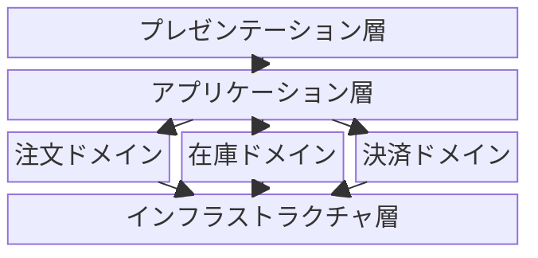
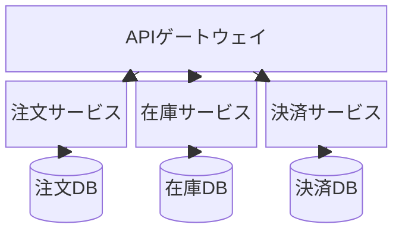

# ブロック図（block-beta）

> ⚠️ **beta構文**: 表示環境によってレンダリングされない場合があります。使用前に確認してください。

## 概要

グリッドベースでブロック（コンポーネント）を配置し、システム構成を表現する図。レイアウトをより細かくコントロールできる。

## 使いどころ

- システムの物理的・論理的なコンポーネント配置
- レイアウト指定が必要なアーキテクチャ図
- 画面レイアウトの概略（ワイヤーフレーム的用途）

## 使わないケース

- フローや順序が重要 → `flowchart`
- サービス間の依存・通信 → `architecture-beta`

---

## 基本テンプレート

```
block-beta
    columns 3
    A["ブロックA"]:2
    B["ブロックB"]
    C["ブロックC"]:3
    A --> C
```

`columns N` でグリッドの列数を指定。`:N` でブロックの幅（列数）を指定。

---

## 実例

### 例1: レイヤードアーキテクチャ



### 例2: マイクロサービス構成


