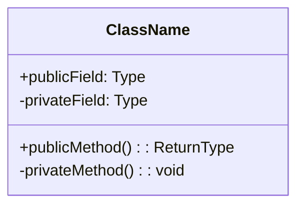
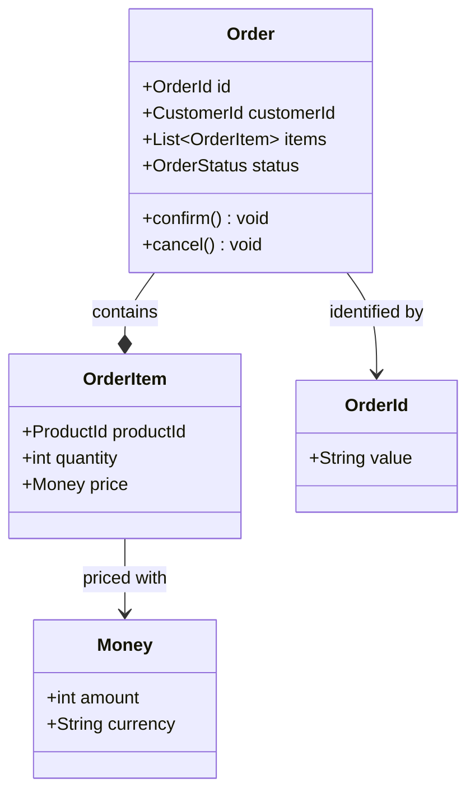
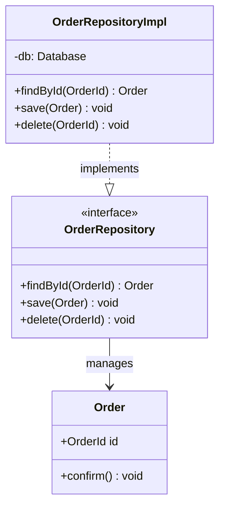
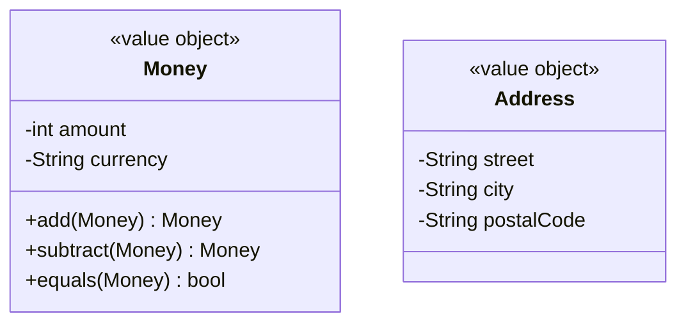

# クラス図（classDiagram）

## 概要

クラスの属性・メソッドと、クラス間の関係（継承・コンポジション・依存など）を表現する図。DDDの戦術的パターン（エンティティ・値オブジェクト・集約・ドメインサービス）の構造表現に適している。

## 使いどころ

- DDDの集約・エンティティ・値オブジェクトの構造
- インターフェースと実装の関係
- クラス間の継承・コンポジション・依存関係
- リポジトリとドメインオブジェクトの関係

## 使わないケース

- エンティティ間の多重度のみ示したい → `erDiagram`（DBスキーマ寄りの表現）
- 動的な処理順序 → `sequenceDiagram`

---

## 基本テンプレート



---

## 関係の種類

| 記法 | 意味 | 用途 |
|---|---|---|
| `A --|> B` | 継承（A is-a B） | スーパークラス・インターフェース実装 |
| `A --* B` | コンポジション（A has B、Bは独立不可） | 集約内のエンティティ |
| `A --o B` | 集約（A has B、Bは独立可能） | 弱い所有関係 |
| `A --> B` | 関連（A uses B） | 一方向の参照 |
| `A ..> B` | 依存（Aが一時的にBを使う） | メソッド引数・戻り値 |
| `A ..|> B` | 実現（インターフェース実装） | `<<interface>>` の実装 |

---

## 実例

### 例1: DDDの集約構造



### 例2: リポジトリパターン



### 例3: 値オブジェクトと不変性の表現



---

## ステレオタイプ（DDDでよく使う）

```
<<entity>>          # エンティティ
<<value object>>    # 値オブジェクト
<<aggregate root>>  # 集約ルート
<<domain service>>  # ドメインサービス
<<interface>>       # インターフェース
<<repository>>      # リポジトリ
```
