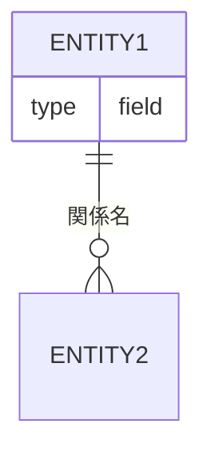
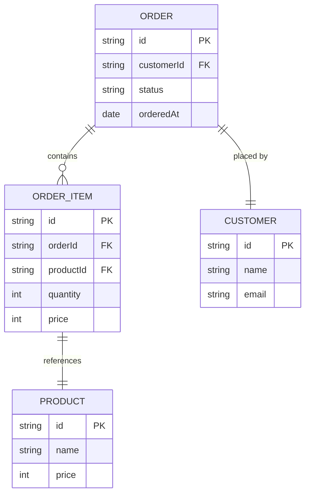
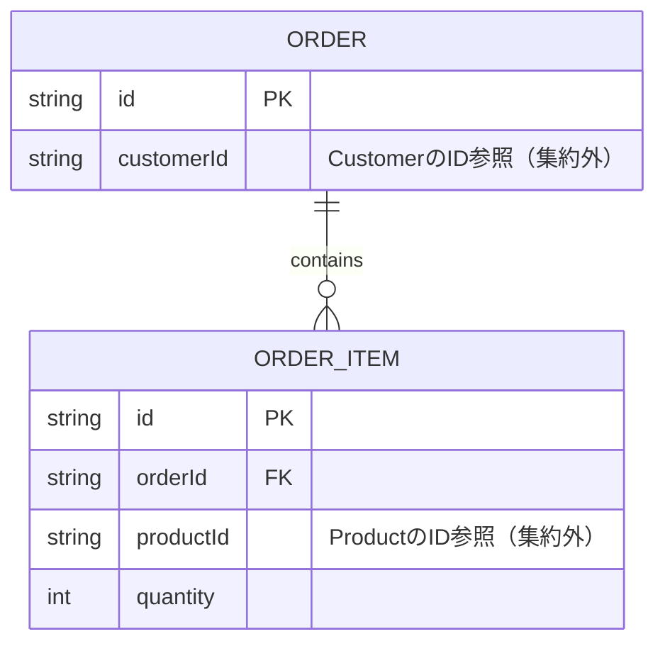

# ER図（erDiagram）

## 概要

エンティティ間の関係と多重度を表現する図。データ構造・ドメインモデルの関係を「何対何」の視点で示す。

## 使いどころ

- ドメインモデルのエンティティ間の関係・多重度
- データベーススキーマの設計・確認
- 集約をまたぐ参照関係の整理

## 使わないケース

- クラスのメソッド・継承関係 → `classDiagram`
- 処理の順序 → `sequenceDiagram`

---

## 基本テンプレート

---

## 多重度の記法

| 左側 | 右側 | 意味 |
|---|---|---|
| `\|o` | `o\|` | ゼロまたは1 |
| `\|\|` | `\|\|` | ちょうど1 |
| `}o` | `o{` | ゼロ以上（0...*） |
| `}\|` | `\|{` | 1以上（1...*） |

組み合わせ例：
- `\|\|--o{` : 1対多（1つのAに0以上のB）
- `\|\|--\|\|` : 1対1
- `}o--o{` : 多対多

---

## 実例

### 例1: 受注ドメインのエンティティ関係

### 例2: 集約をまたぐ参照（IDのみ）

