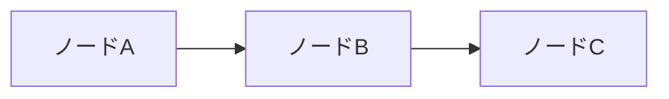
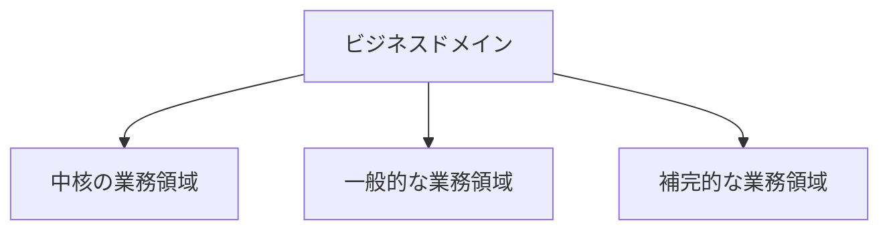
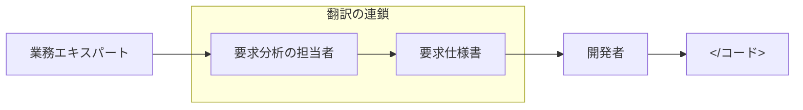
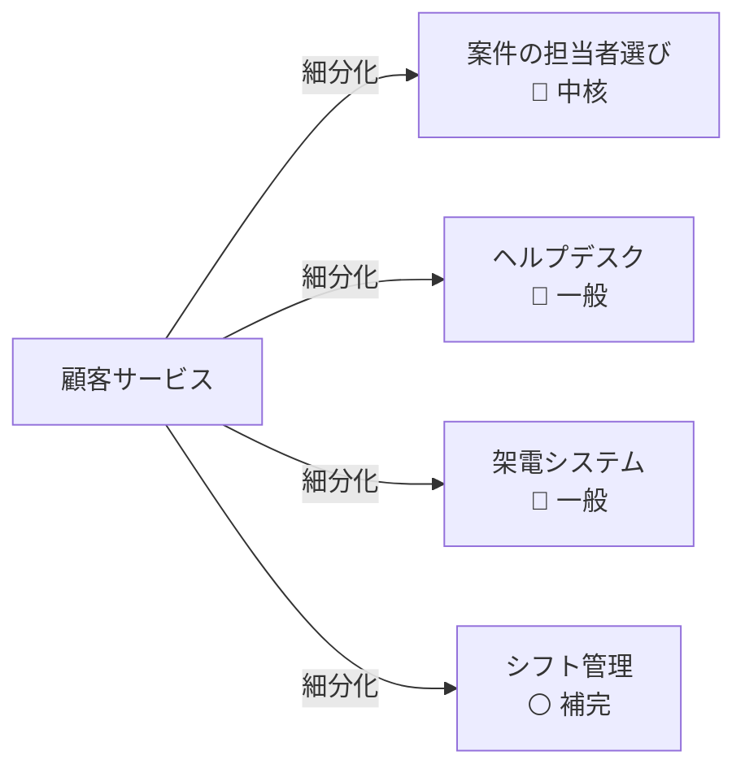
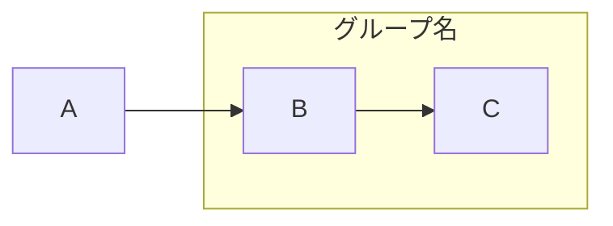

# フローチャート（flowchart）

## 概要

ノードと矢印で構成される汎用の関係・フロー図。Mermaidで最も多用する構文。方向によって階層図・プロセス図・関係図を使い分ける。

## 使いどころ

- **TD（上→下）**: 階層・包含関係、ツリー構造、組織図
- **LR（左→右）**: プロセス・変換フロー、役割・関係図、依存の流れ

## 使わないケース

- アクター間のメッセージ順序 → `sequenceDiagram`
- クラス・継承関係 → `classDiagram`
- エンティティの多重度 → `erDiagram`
- 状態遷移 → `stateDiagram-v2`

---

## 基本テンプレート

---

## ノードの形

| 記法 | 形 | 用途 |
|---|---|---|
| `[text]` | 四角形 | 一般的なノード |
| `(text)` | 角丸四角形 | 開始・終了・状態 |
| `((text))` | 円形 | イベント・ポイント |
| `{text}` | ひし形 | 分岐・条件（判断フローはテキスト形式を推奨） |
| `[(text)]` | 円柱 | データベース・ストレージ |
| `[/text/]` | 平行四辺形 | 入出力 |
| `[[text]]` | 二重四角形 | サブルーチン |

## 矢印の種類

| 記法 | 見た目 | 用途 |
|---|---|---|
| `-->` | 実線矢印 | 通常の関係・フロー |
| `---` | 実線（矢印なし） | 関連・接続 |
| `-.->` | 点線矢印 | 非同期・弱い依存 |
| `==>` | 太線矢印 | 強調・主要フロー |
| `--\|ラベル\|-->` | ラベル付き矢印 | 関係の説明 |

---

## 実例

### 例1: 階層・包含関係（TD）

### 例2: プロセス・変換フロー（LR）

### 例3: 役割・関係図（LR）+ subgraph

### 例4: 細分化・分解（LR）

---

## subgraphの使い方

subgraphは関連するノードをまとめてグルーピングするときに使う。境界づけられたコンテキストや業務領域の境界の表現に有効。
