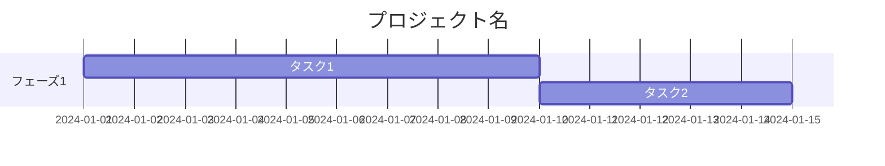
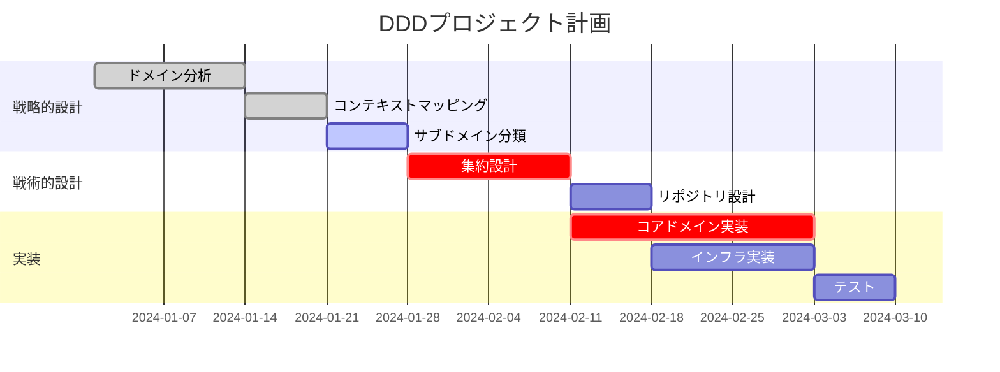

# ガントチャート（gantt）

## 概要

タスクの期間・依存関係・進捗をバーで表現するプロジェクト管理図。

## 使いどころ

- プロジェクトのスケジュール管理
- タスクの依存関係と並行作業の可視化
- フェーズ・マイルストーンの表示

## 使わないケース

- 時系列の出来事（期間が不要） → `timeline`
- 処理の順序 → `sequenceDiagram`

---

## 基本テンプレート



---

## タスクの状態

| 記法 | 意味 |
|---|---|
| `done` | 完了 |
| `active` | 進行中 |
| `crit` | クリティカルパス（赤表示） |
| なし | 未着手 |

---

## 実例

### 例1: DDDプロジェクトのスケジュール



---

## 日付形式のオプション

```
dateFormat YYYY-MM-DD   # 絶対日付
after タスクID          # 相対（別タスクの後）
Nd                      # N日間（5d = 5日）
Nw                      # N週間
```
