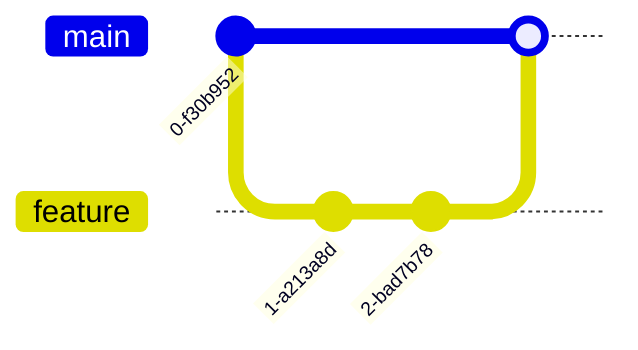
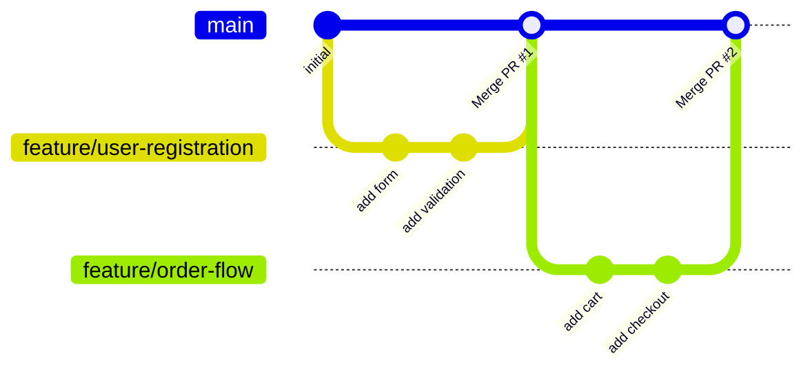
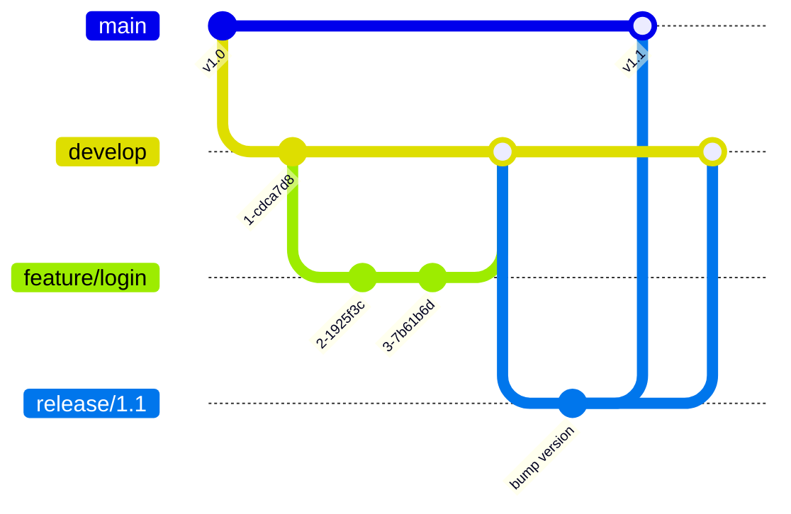

# Gitグラフ（gitGraph）

## 概要

Gitのブランチ・コミット・マージの履歴を視覚化する図。

## 使いどころ

- ブランチ戦略の説明（Git Flow, GitHub Flow等）
- リリースフロー・開発フローの設計図
- マージ・チェリーピックの手順説明

## 使わないケース

- プロセスの流れ全般 → `flowchart`
- スケジュール → `gantt`

---

## 基本テンプレート

---

## 主要コマンド

| コマンド | 説明 |
|---|---|
| `commit` | 現在のブランチにコミット |
| `commit id: "メッセージ"` | IDまたはメッセージ付きコミット |
| `branch ブランチ名` | ブランチを作成 |
| `checkout ブランチ名` | ブランチを切り替え |
| `merge ブランチ名` | 現在のブランチにマージ |
| `cherry-pick id: "コミットID"` | 特定コミットのチェリーピック |

---

## 実例

### 例1: GitHub Flow

### 例2: Git Flow

