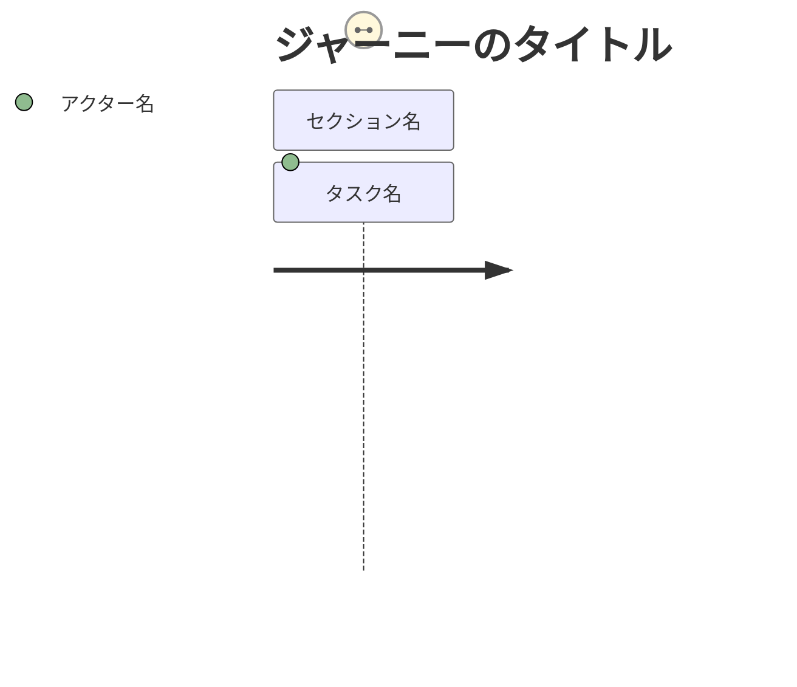
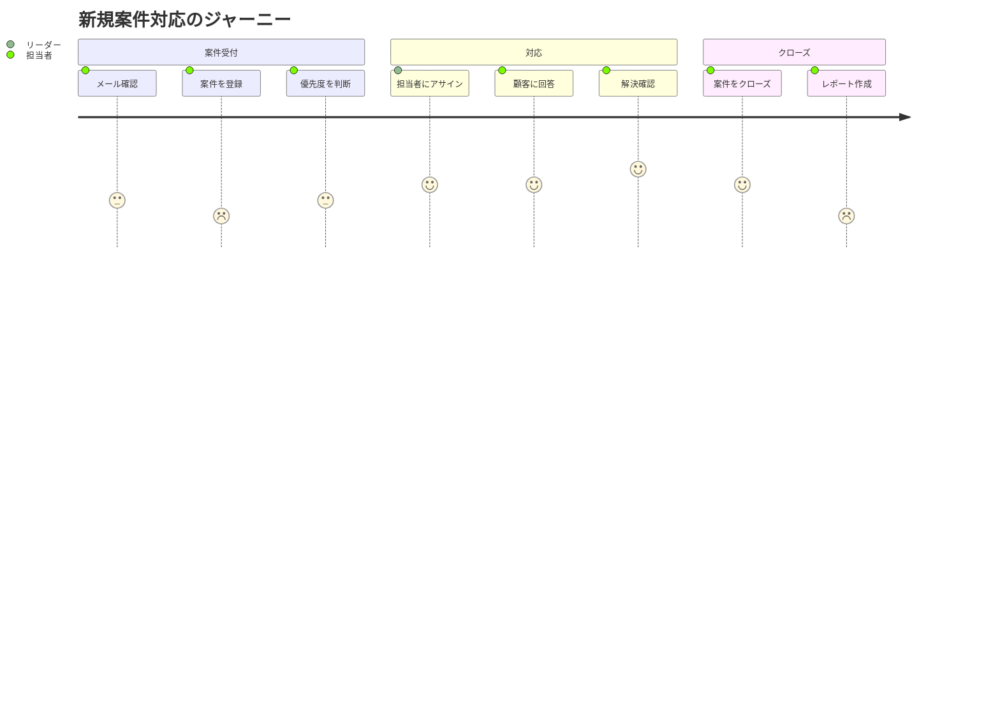
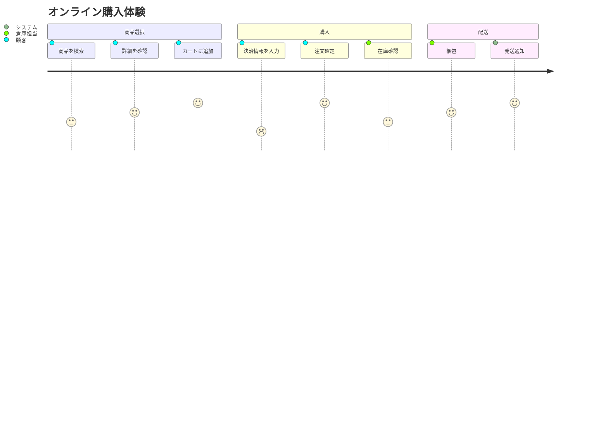

# ユーザージャーニー（journey）

## 概要

ユーザーが目標を達成するまでの体験の流れを、各ステップのスコア（満足度）とともに表現する図。

## 使いどころ

- ユーザー体験（UX）の可視化
- 業務フローの「つらさ」の見える化
- 改善ポイントの特定

## 使わないケース

- システム間の処理順序 → `sequenceDiagram`
- 状態の変化 → `stateDiagram-v2`

---

## 基本テンプレート

スコアは `1`（最低）〜`5`（最高）で指定する。

---

## 実例

### 例1: ヘルプデスク担当者のジャーニー

### 例2: 複数アクターの比較

