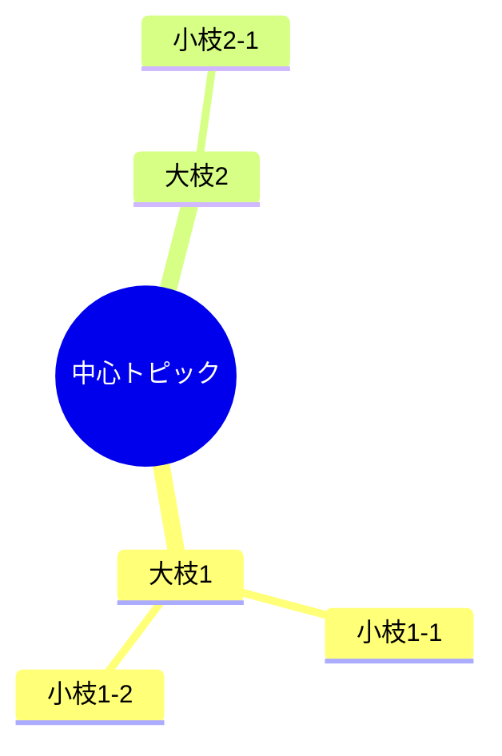
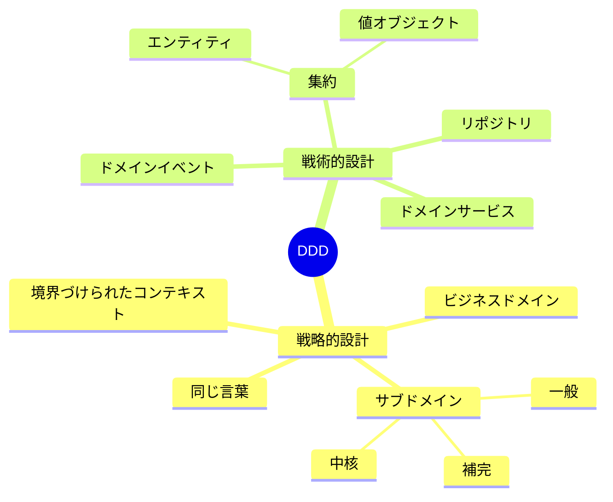
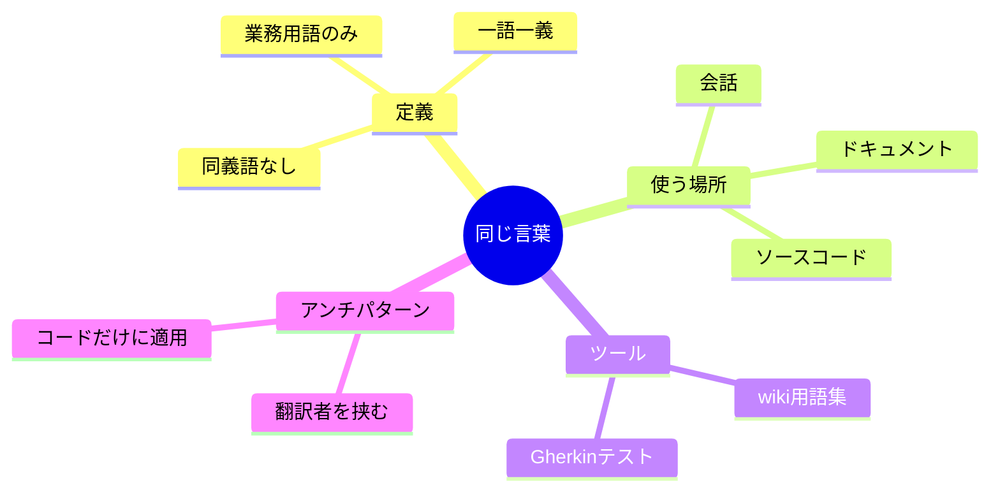

# マインドマップ（mindmap）

## 概要

中心トピックから放射状に枝分かれする階層構造の図。概念の全体像・関係性を俯瞰するのに適している。

## 使いどころ

- 概念・知識の全体像を俯瞰する
- ブレインストーミングの整理
- ドメインの概念マップ（concept-map）

## 使わないケース

- 順序・フローが重要 → `flowchart`
- 関係の方向が重要 → `flowchart` or `sequenceDiagram`

---

## 基本テンプレート

インデントで階層を表現する。ルートは `(())` で円形にするのが慣例。

---

## ノードの形

| 記法 | 形 |
|---|---|
| `text` | デフォルト（角丸） |
| `(text)` | 円形 |
| `((text))` | 二重円 |
| `[text]` | 四角形 |
| `))text((` | 雲形 |

---

## 実例

### 例1: DDDの概念マップ

### 例2: ユビキタス言語の概念マップ

