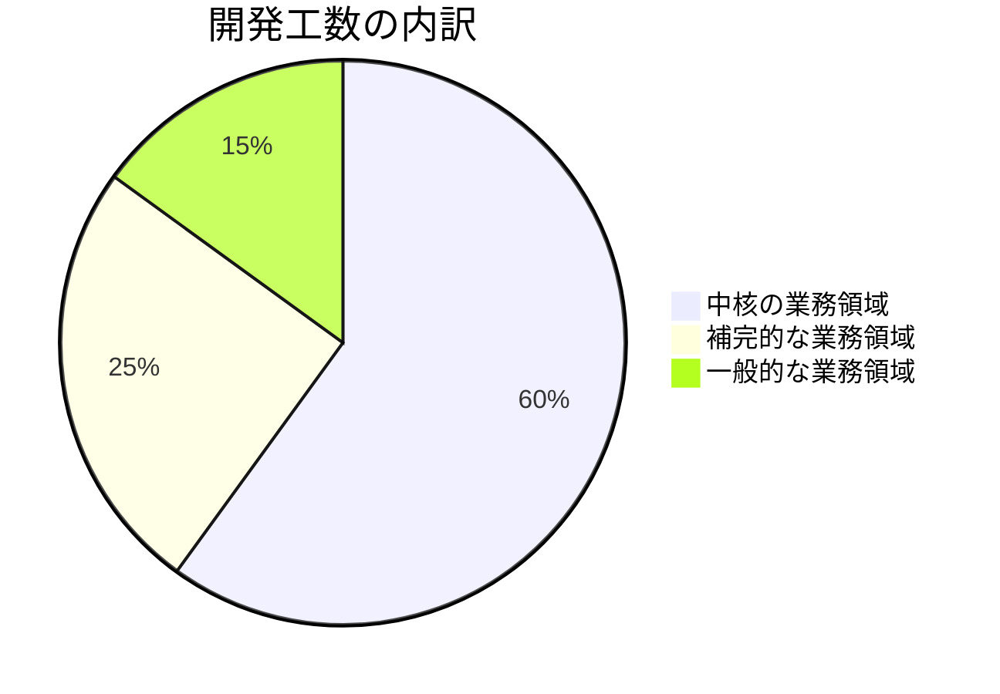
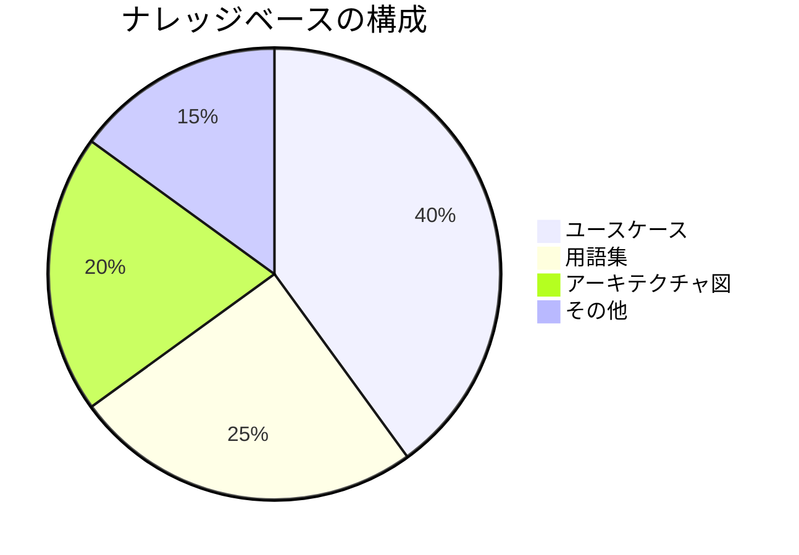
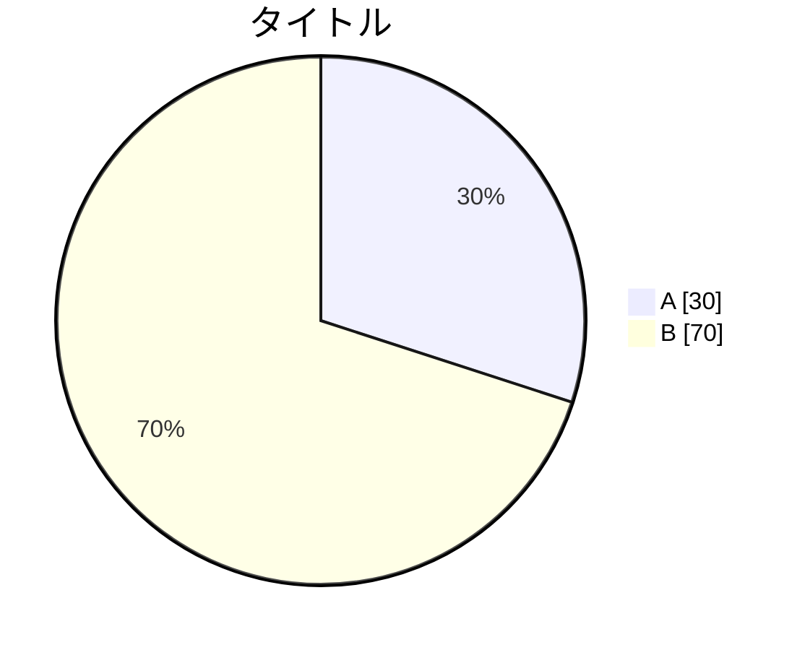

# 円グラフ（pie）

## 概要

全体に対する各要素の割合を扇形で表現する図。

## 使いどころ

- カテゴリ別の構成比（業務領域の割合など）
- リソース配分・工数の内訳
- 集計データの可視化

## 使わないケース

- 要素間の関係・順序が重要 → `flowchart`
- 時系列の変化 → `xychart-beta`
- 要素が6個以上で見分けにくい → テーブル形式を検討

---

## 基本テンプレート


値は数値（割合ではなく量）で指定する。合計が自動的に100%になるよう換算される。

---

## 実例

### 例1: 開発工数の内訳



### 例2: ドキュメントの種類別割合



---

## オプション

```
showData    # 実際の数値もラベルに表示する
```


