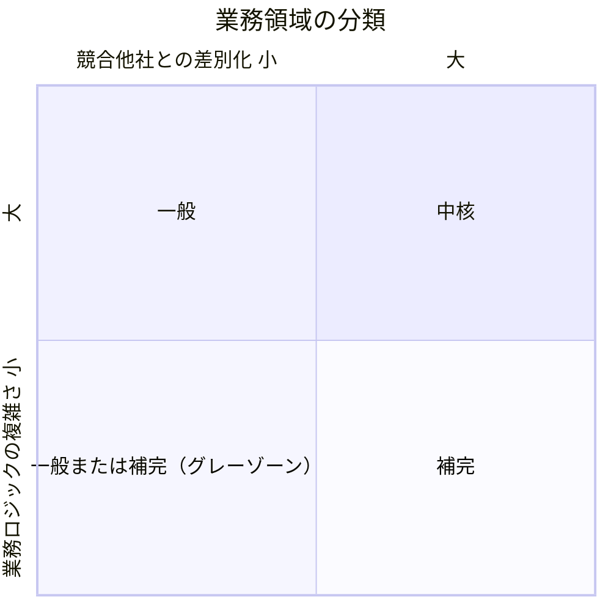
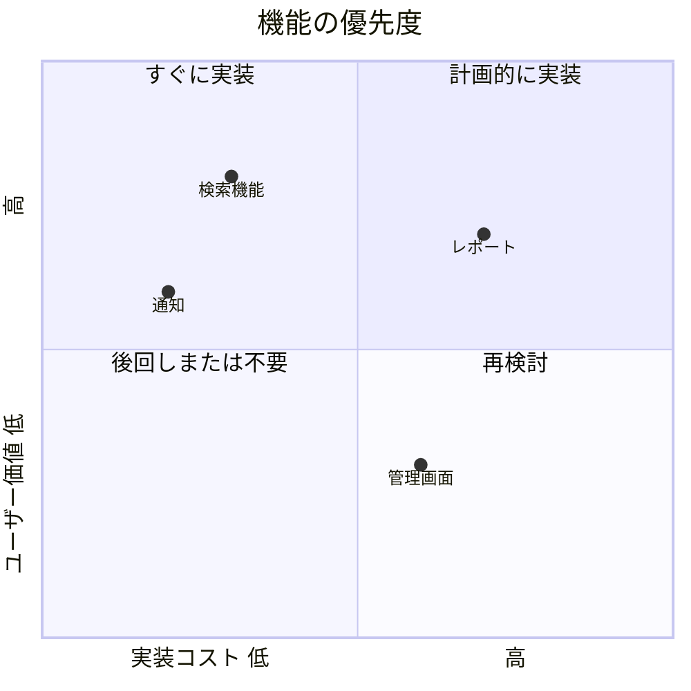

# 象限チャート（quadrantChart）

## 概要

X軸・Y軸の2軸でエリアを4象限に分割し、各要素をプロットする図。2つの評価軸でアイテムを分類・比較するときに使う。

## 使いどころ

- 2軸の分類マトリクス（複雑さ vs 競争優位 など）
- ポートフォリオ分析・優先度マッピング
- DDDのサブドメイン分類（中核・一般・補完）

## 使わないケース

- 軸が1つ → `pie` or `xychart-beta`
- 個々の要素に詳細な情報が必要 → `flowchart` + ノード
- 要素数が多く座標管理が煩雑 → テーブル形式を検討

---

## 基本テンプレート

```mermaid
quadrantChart
    title チャートのタイトル
    x-axis 低い X ラベル --> 高い X ラベル
    y-axis 低い Y ラベル --> 高い Y ラベル
    quadrant-1 右上の象限名
    quadrant-2 左上の象限名
    quadrant-3 左下の象限名
    quadrant-4 右下の象限名
    アイテム名: [x座標, y座標]
```

座標は `0.0`〜`1.0` の範囲で指定する。

象限の番号：
- `quadrant-1` : 右上（X大、Y大）
- `quadrant-2` : 左上（X小、Y大）
- `quadrant-3` : 左下（X小、Y小）
- `quadrant-4` : 右下（X大、Y小）

---

## 実例

### 例1: サブドメイン分類（図1-1相当）



### 例2: 機能の優先度マッピング


