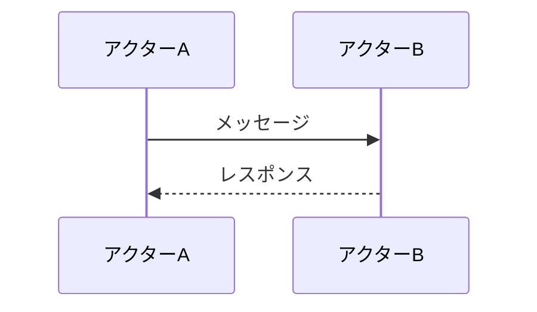
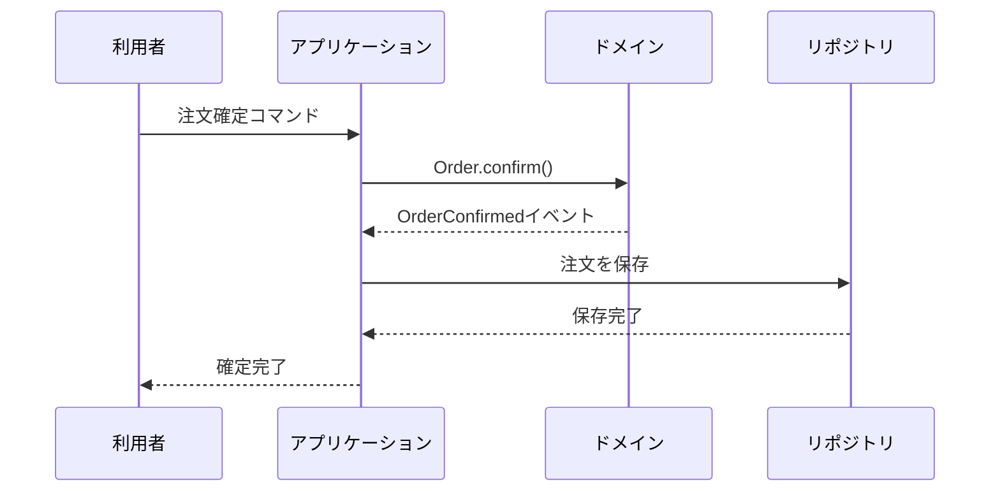
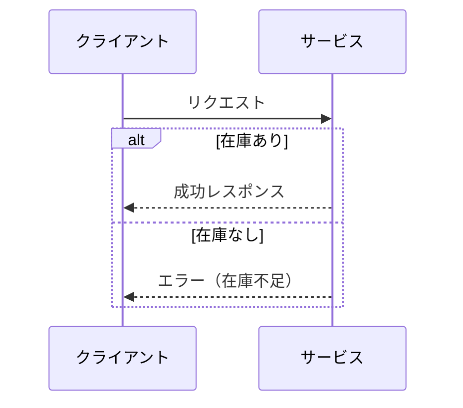
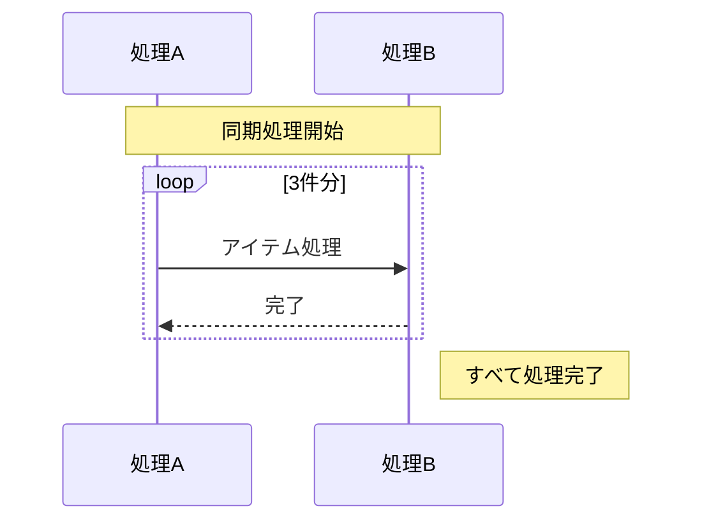

# シーケンス図（sequenceDiagram）

## 概要

アクター（登場人物・システム）間のメッセージのやり取りを時系列で表現する図。「誰が誰に何を送るか」の順序を示す。

## 使いどころ

- ユースケースの処理フロー（どのコンポーネントが何を呼ぶか）
- ドメインイベントの発生から通知までの流れ
- APIコール・サービス間通信の順序
- コマンドとイベントの連鎖

## 使わないケース

- 静的な構造・関係 → `flowchart` or `classDiagram`
- 状態の変化 → `stateDiagram-v2`

---

## 基本テンプレート



---

## メッセージの種類

| 記法 | 線種 | 矢印 | 用途 |
|---|---|---|---|
| `->>` | 実線 | 矢印あり | 同期呼び出し・リクエスト |
| `-->>` | 点線 | 矢印あり | 非同期レスポンス・戻り値 |
| `->` | 実線 | 矢印なし | メッセージ送信 |
| `-->` | 点線 | 矢印なし | 非同期通知 |
| `-x` | 実線 | × | 失敗・エラー |

---

## 実例

### 例1: コマンドとイベントの流れ



### 例2: 条件分岐（alt）



### 例3: ループと注釈（Note）



---

## 主要オプション

```
autonumber          # メッセージに連番を付ける
activate A          # アクターをアクティブ表示（処理中）
deactivate A        # アクティブ解除
```
