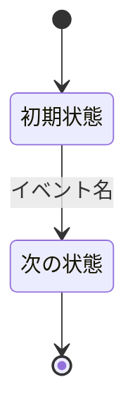
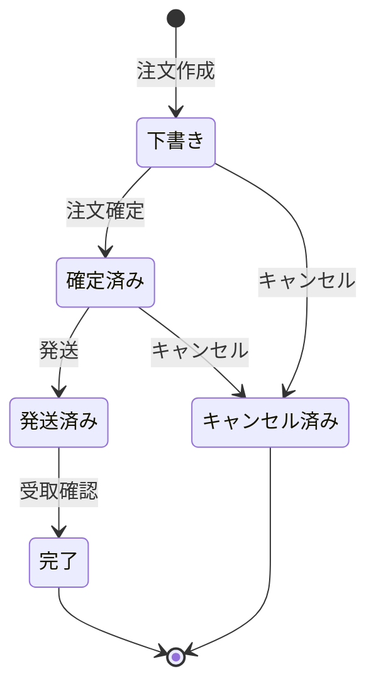
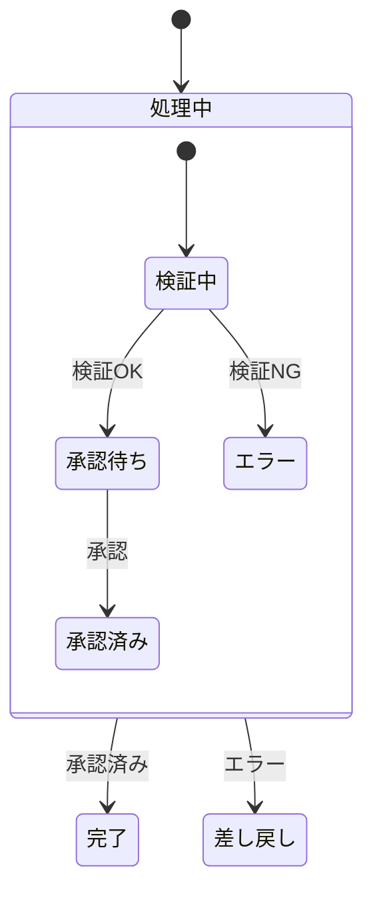
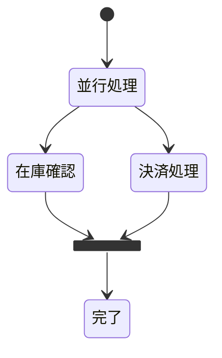

# 状態遷移図（stateDiagram-v2）

## 概要

オブジェクトの状態と、状態を変化させるイベント・条件を表現する図。集約の状態ライフサイクルを可視化するのに適している。

## 使いどころ

- 集約（注文・申請・チケット等）のライフサイクル
- 業務プロセスの状態管理
- ドメインイベントによる状態遷移

## 使わないケース

- 処理の順序（誰が何を呼ぶか） → `sequenceDiagram`
- 静的な構造 → `flowchart` or `classDiagram`

---

## 基本テンプレート



`[*]` は開始・終了を表す。

---

## 実例

### 例1: 注文のライフサイクル



### 例2: 複合状態（サブ状態）



### 例3: 並行状態（fork/join）



---

## 主要オプション

```
note right of 状態名 : 補足説明       # 注釈
note left of 状態名 : 補足説明
state "長い状態名" as 短縮名           # エイリアス
```
