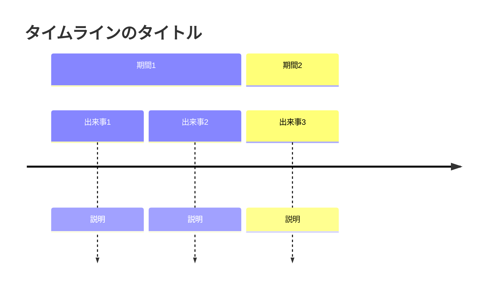
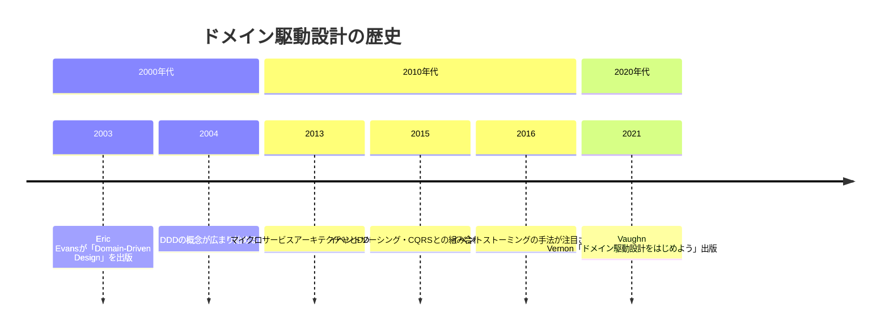
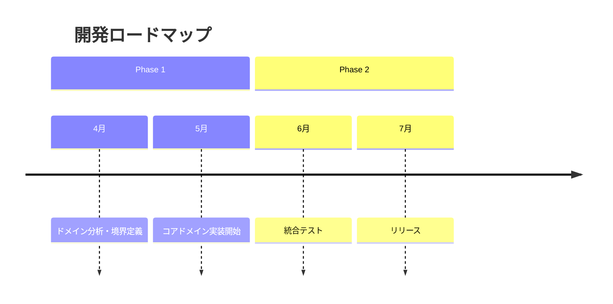

# タイムライン（timeline）

## 概要

時系列の出来事を年表形式で表現する図。歴史・プロセスの進化・ロードマップを表すのに適している。

## 使いどころ

- 技術・業界の歴史的な変遷
- プロジェクトのマイルストーン・ロードマップ
- 概念の発展史

## 使わないケース

- タスクの期間・並行作業 → `gantt`
- 処理の順序 → `sequenceDiagram`

---

## 基本テンプレート

---

## 実例

### 例1: DDDの歴史

### 例2: プロジェクトロードマップ

