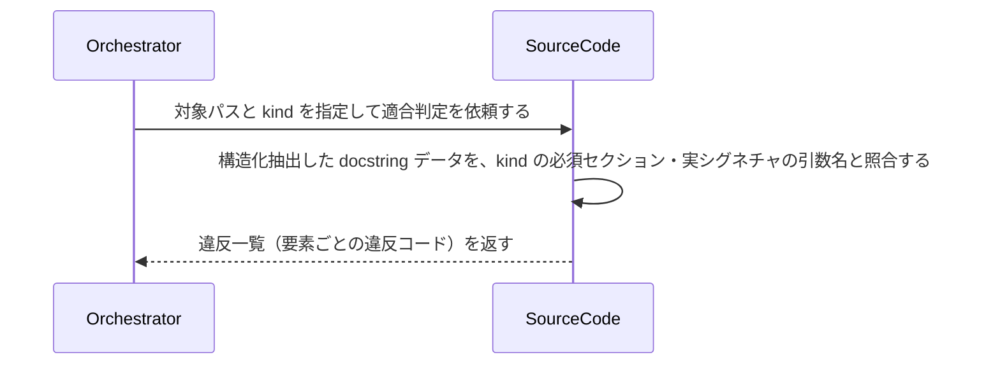

# uc-lint-doc-comment

---

## 概要

ソースコードの docstring が DocCommentSchema の kind に定める構造に適合するかを判定する。

---

## 主アクターと意図

- **主アクター**: Orchestrator（HarnessAgent）
- **意図**: 対象コードベースの docstring が規約どおりの構造か（必須セクションの有無・引数名と実シグネチャの整合）を確認したい

---

## 関与する外部

- DocCommentSchema（適合判定の基準）
- uc-scan-source-code（構造化抽出済みデータの入力元）

---

## 事前条件

- 対象コードベース（ディレクトリ）のパスが要望テキストで与えられている
- 対象言語に対応する DocCommentSchema の kind が解決できる

---

## 基本フロー



---

## 事後条件

- 違反が無ければ空配列が返る（全要素が適合）
- 違反があれば要素ごとに違反コードと箇所が返る
- docstring の“意味”（要約行の語選びの適切さ等）は判定しない（機械判定できない範囲は対象外）

---

## 受け入れ基準

- When 公開要素に docstring が無いとき、エンジンは MISSING_DOC_COMMENT 違反として報告する shall。
- When 要約行が空のとき、エンジンは EMPTY_SUMMARY 違反として報告する shall。
- When Args セクションの引数名が実シグネチャの引数名と一致しないとき、エンジンは ARGS_MISMATCH 違反として報告する shall。
- While 全要素が適合しているとき、エンジンは空配列を返す（正常系）shall。
- If 対象言語に対応する DocCommentSchema の kind が無いとき、エンジンは UNSUPPORTED_KIND エラーを返す shall。

---

## エラー

| コード | 条件 |
|---|---|
| `UNSUPPORTED_KIND` | 対象言語に対応する DocCommentSchema の kind が無い |
| `INVALID_PATH` | 対象パスが存在しない |

---

## テストシナリオ

### 全要素が規約に適合するとき違反なしと判定する

| 分類 | 観点 |
|---|---|
| 正常系 | 適合：違反ゼロは正常系（空配列） |

```gherkin
Scenario: 全要素が規約に適合するとき違反なしと判定する
  Given DocCommentSchema の google kind に適合する docstring だけを持つコードベース
  When 適合判定を実行する
  Then 違反は空配列で返り、エラーにはならない
```

### docstring が無い公開要素を検出する

| 分類 | 観点 |
|---|---|
| 異常系 | 違反：MISSING_DOC_COMMENT |

```gherkin
Scenario: docstring が無い公開要素を検出する
  Given docstring を持たない公開関数を含むコードベース
  When 適合判定を実行する
  Then その要素について MISSING_DOC_COMMENT 違反が報告される
```

### Args の引数名がシグネチャと不一致な要素を検出する

| 分類 | 観点 |
|---|---|
| 異常系 | 違反：ARGS_MISMATCH（構造照合の核） |

```gherkin
Scenario: Args の引数名がシグネチャと不一致な要素を検出する
  Given Args セクションの引数名が実シグネチャと異なる関数を含むコードベース
  When 適合判定を実行する
  Then その要素について ARGS_MISMATCH 違反が報告される
```

### 対応する kind が無い言語は UNSUPPORTED_KIND

| 分類 | 観点 |
|---|---|
| 異常系 | エラー：未対応言語の扱い |

```gherkin
Scenario: 対応する kind が無い言語は UNSUPPORTED_KIND
  Given DocCommentSchema に定義の無い言語のコードベース
  When 適合判定を実行する
  Then UNSUPPORTED_KIND エラーが返る
```
