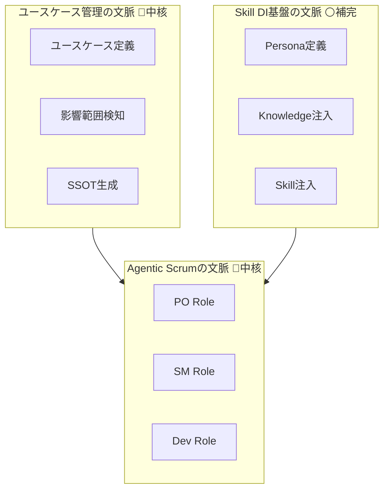
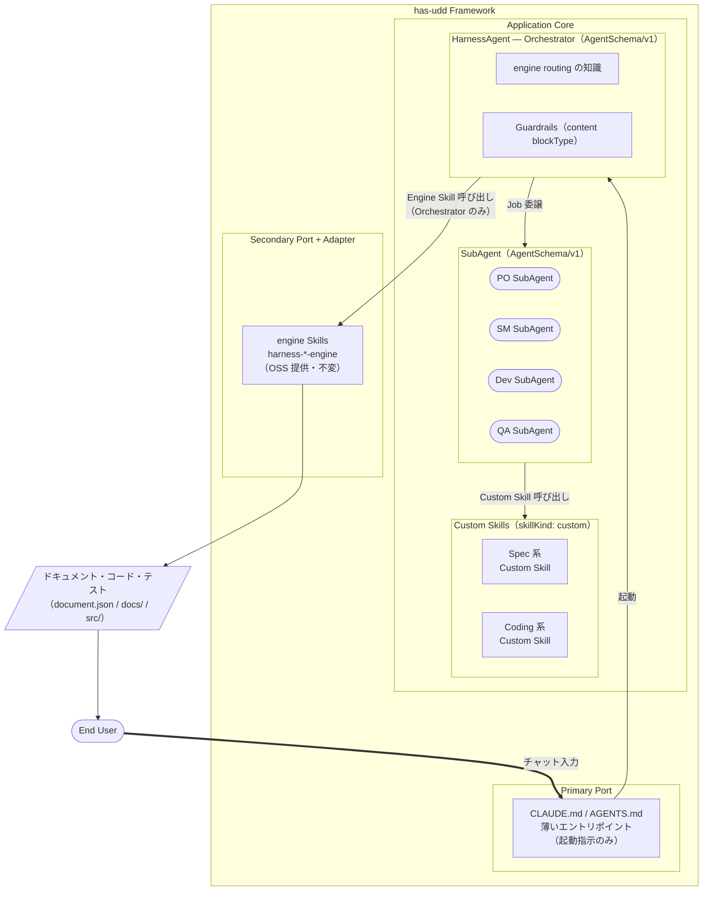
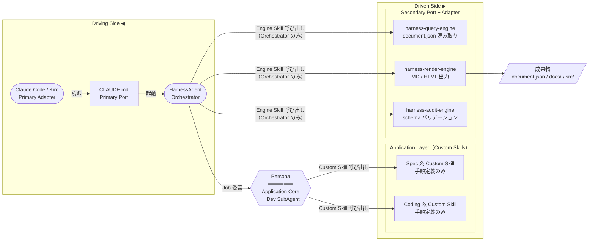

# ブレインストーミング: has-uddのプロダクトコンセプト設計

**目的:** has-udd（Harness Agentic Scrum Usecase-Driven-Development）の中核概念・設計方針・構成要素を決定し、OSSとしての開発指針を固める
**モード:** アイデア発散
**思考フレーム:** `/ddd-advisor`（「ドメイン駆動設計をはじめよう」準拠）

---

## DDDフレーミング: has-uddそのものの業務領域分析

「ドメイン駆動設計をはじめよう」の業務領域（サブドメイン）分類をhas-udd自体に適用する。

### has-uddのサブドメイン分類

| 機能領域 | 分類 | 根拠 |
|---|---|---|
| **Usecase-Driven仕様管理**（SSOT・影響範囲検知） | 🔴 中核 | 「仕様と実装の乖離を防ぐ」という差別化の核心。既存の解決策が存在しない |
| **Agentic Scrumオーケストレーション**（PO/SM/Dev Role） | 🔴 中核 | AI×スクラムの組み合わせは新しく、他社が容易に模倣できない |
| **Skill/Knowledge DI基盤**（ポートとアダプター） | ⚪ 補完 | OSSフレームワークの骨格として必要だが、競争優位は生まない |
| **Harness実行基盤**（エージェントの呼び出し・並列実行） | ⚪ 補完 | LangGraph・CrewAI等の既存ツールで代替可能。差別化にならない |
| **スクラムセレモニー定義**（スプリント・レトロ等） | 🔵 一般 | スクラムガイド・Jira等の既存の解決策がある |

### 設計指針（DDD原則から導出）

```
中核の業務領域 → 社内開発必須・深いドメインモデルで実装する
補完の業務領域 → 機能すればよい・トランザクションスクリプトでもよい
一般の業務領域 → 既存ライブラリ・規格を使う（独自実装しない）
```

**has-uddの場合:**
- `Usecase-Driven仕様管理` と `Agentic Scrumオーケストレーション` に設計の95%を集中させる
- `Harness実行基盤` は既存のLangGraph/CrewAI/Claude Code Agentを活用する（独自実装しない）
- `スクラムセレモニー` はスクラムガイドをKnowledgeとして注入するだけでよい

### has-uddの区切られた文脈（境界の候補）



**ユビキタス言語（has-udd内で統一すべき言葉）:**

> **語彙更新（重要・最新合意）**: 「Job Agent / Job エージェント」は **Role** に改名（職種＝アジャイルの役割）。「Job」は **Orchestrator が Role に委譲する1回の作業実行（実行追跡レコード）** の意味に限定。実装計画の作業項目は将来 **Task** として別語に温存。Custom Skill を「ユースケース」と呼ばない（UsecaseSpec の DDD ユースケースと衝突するため）。engine 認識は Orchestrator のみ。

| 言葉 | has-uddにおける定義 |
|---|---|
| **ユースケース** | （DDD）1人のアクターが1つの目的を達成するための業務操作（= DDDのアプリケーションサービスの1メソッド）。UsecaseSpec が表現する。※ Custom Skill を「ユースケース」とは呼ばない |
| **Role（職種）** | アジャイルチームの役割（PO/SM/Dev/QA/Backend/Frontend…）。Persona（観点・レンズ）＋担当 Custom Skill 群（skillRefs）＋不変 knowledge（knowledgeRefs）を持つ。agentKind: "subagent" のエージェントが体現する。旧称「Job Agent」 |
| **SubAgent** | Role を体現する実行単位（技術的 agentKind）。HarnessAgent（Orchestrator）から Job を委譲されて動く。engine を直接呼ばない |
| **HarnessAgent** | Orchestrator。ユーザー指示を解釈し Role へ Job を委譲する Application Core。**engine 認識を持つ唯一のレイヤー** |
| **Job** | Orchestrator が Role に委譲する**1回の作業実行**（追跡レコード・状態機械 PENDING→RUNNING→DONE/FAILED）。※「実装計画の作業項目」は Task として別語に温存 |
| **スプリント** | 1〜2週間でユースケース群を実装完了させる Role の協調サイクル |
| **Skill** | ヘキサゴナルアーキテクチャにおけるアダプター。engine Skill（skillKind: engine・インフラ基盤）と Custom Skill（skillKind: custom・Role が行う能力単位）の2種別 |

---

## アイデアダンプ

1. ユースケース単位でスプリントバックログを管理し、エージェントが自律的にタスク分解する
2. PO/SM/Devの役割エージェントをプラグイン形式でDIできるフレームワーク
3. ユースケース仕様をYAML/JSONで定義し、そこからJavaDocとAI用コンテキストを自動生成（SSOT）
4. ヘキサゴナルアーキテクチャでポート（エージェントの入出力）とアダプター（スキル）を分離
5. スクラムセレモニー（スプリントプランニング・レビュー・レトロ）をエージェントが自律実行
6. DDDの集約・ユースケース・境界づけられたコンテキストをエージェント境界に対応させる
7. コード変更を検知して影響を受けるユースケースを自動特定し、仕様との乖離を警告する
8. エージェントのSkillをOSSコミュニティで共有できるSkillレジストリ
9. ユースケースの「受け入れ条件」をエージェントが実行可能なテストに変換する
10. 人間のPOがユースケースを書くとエージェントチームが実装〜テスト〜PRまで自律完結する
11. SSOTとしてユースケースファイルを中心に、コード・ドキュメント・テストが放射状に生成される
12. Role（職種）にPersona（役割特性）とSkillsを別々に注入できる構成

**絞り込み候補:**
1. **ユースケースSSOT構造** — 仕様・コード・テストの単一情報源。今回の課題の核心を直接解決する
2. **Role（職種）へのDI設計** — ヘキサゴナル思想を活かした拡張性の要。OSSとしての差別化点
3. **ユースケース単位の影響範囲検知** — 「実装変更が仕様に波及する問題」を根本解決するメカニズム
4. **スクラムセレモニーのエージェント化** — HarnessAgenticScrumというコンセプトの具体化

---

## 論点 1: 「ユースケース」の粒度と定義をどう決めるか？

DDDの業務ロジックを構成するユースケースを管理単位とするとのことだが、その「ユースケース」は何をもって一単位とするかが設計全体の根幹になる。

### AI 初期見解
**見解:** ユースケースは「一人のアクターが一つの目的を達成するための業務上の操作」を単位とし、DDDのアプリケーションサービスのメソッド（または集約のコマンド）に対応させるのが最も整合的だと考える。

**根拠:**
- DDDでは集約がトランザクション境界であり、一つのコマンドで一つの集約を変更する原則がある。この粒度がコード変更と仕様変更の波及範囲を自然に一致させるから
- ユーザーストーリー（「〜として、〜したい」）は粒度が大きすぎてタスク分解が必要になり、詳細設計ドキュメントへの依存が復活するリスクがあるから
- アプリケーションサービスのメソッド単位であれば、実装・テスト・ドキュメントが1:1:1で対応でき、SSOTの維持が現実的になるから

### ユーザー見解
> ユースケースは「業務領域を構成する業務単位」の話。
> スクラムではPBIがあり、POは業務エキスパートとしてユーザーストーリー・受け入れ条件をPBIに書く。
> POにDDDの深い知識は不要。境界・サブドメインを考えるのはDevの仕事。
> 仕様をまとめるのもDevであり、その単位が「ユースケース」。
> PBIとユースケースは「ある程度」一致することが好ましい。

### AI 再考見解
**見解:** ユーザー見解を受けて、ユースケースの定義に「誰が何を責任を持つか」という次元が加わった。粒度としてはDDDのアプリケーションサービスのメソッドレベルという当初の見解は維持するが、到達プロセスが重要な追加情報だった。

つまりhas-uddの流れは「PBIを起点にDevがユースケース単位に整理する」という二段階構造になる。POのPBIは粗い粒度（ユーザーストーリー）で書かれてよく、Devエージェントがそれを受けてDDD知識でユースケース単位に細分化・仕様化するのが正しい姿だ。

この整理により：
- POエージェントは業務エキスパートとして「何を達成したいか」を記述する責任を持つ
- DevエージェントはDDD Skillを注入されることで「それを業務操作単位に落とし込む」責任を持つ
- この分業がhas-uddのRole設計の根拠になる

### 合意決定
**決定:** ユースケース = 「業務領域内の業務操作の単位」。DDDのアプリケーションサービスのメソッドレベルに対応する。POのPBIより細かい（または同等）粒度で、Devが整理して確定させる。

**理由:** POは業務エキスパートであり、DDDの設計責任はDevが持つ。PBIはユーザーストーリーで書かれてよく、Devエージェントが受けてユースケース単位に仕様化するという役割分担が、スクラムのプロセスとDDDの原則の両方と整合する。

**次のアクション:** DevエージェントへのDDD Knowledge注入を必須とする設計にする。また「PBIからユースケース仕様への変換」がDevエージェントの最初のジョブになることを確定し、論点3（Skill DI設計）の前提として使う。

---

## 論点 2: SSOTはどの形式・場所に置くべきか？

「人間が読むものとAIが読むものでレンダリングを分ける」というコンセプトの実現方式として、どこに情報源を置き、どう派生させるかを決める必要がある。

### AI 初期見解
**見解:** SSOTはユースケース定義ファイル（YAML or Markdown構造体）をリポジトリ内に置き、そこからJavaDoc/TSDoc（人間・AIともに参照）とエージェント用コンテキストファイルを生成する二重レンダリング方式が現実的だと考える。

**根拠:**
- コードに近い場所（リポジトリ内）に置くことで、実装変更とユースケース変更を同一PRで追跡できるから。これが「仕様と実装の乖離」を防ぐ最も確実な仕組みだから
- JavaDoc/TSDocは既存の開発ツール（IDE・CI）がそのまま扱えるため、導入コストが低いから
- エージェント用コンテキストは生成物であり編集対象でないことを明示することで、人間が「どのファイルを触ればよいか」迷わなくて済むから

### ユーザー見解
> 区切られた文脈まで考慮したフォルダ構成は管理しきれない。
> トップは業務領域（サブドメイン）の方がやりやすい。
> 厳密すぎると保守しきれない。
> ドキュメントとして管理すべき内容の精査は後で行う。
> ただし詳細設計と実装ができるレベルの情報は必要。

### AI 再考見解
**見解:** 完全に同意。has-uddのコアバリューは「ユースケース仕様のSSO管理」であり「DDD設計ドキュメントの完備」ではない。保守されないドキュメントはないドキュメントより悪い。context-map・model/・サブドメインREADMEは削除し、ユースケースファイル一枚に集約する形が正しい。区切られた文脈の管理はコードと設計判断に任せる。

### 合意決定
**決定:** SSOTの構造はファイル2種類のみ。フォルダ単位はサブドメイン（業務領域）。区切られた文脈はフォルダ構成に出さない。

```
docs/
└── domains/
    ├── customer-management/
    │   ├── model.md            ← 集約・属性・業務ルール・不変条件・ユニットテスト仕様
    │   └── usecases/
    │       ├── README.md
    │       └── register-customer.md
    ├── order-management/
    │   ├── model.md
    │   └── usecases/
    │       ├── README.md
    │       └── create-order.md ← 概要・受け入れ条件・テストシナリオ・仕様
    └── billing-management/
        ├── model.md
        └── usecases/
```

**理由:**
- サブドメインは安定（事業が変わらない限り不変）。区切られた文脈は変化するのでフォルダに出さない
- ドメインモデルは仕様として管理する（コードだけではAgentが実装できない）
- 集約・エンティティは各サブドメインで独自定義。他サブドメインの集約は共有しない
- 値オブジェクトは `model.md` 内で参照として記載するだけ（定義は所有サブドメインに1箇所）
- テスト要件はファイルを増やさず既存2ファイルの中に含める（`model.md` にユニットテスト仕様、`usecases/` にテストシナリオ）

**各ファイルの記載項目（概要）:**

| ファイル | 記載内容 | 主な読者 |
|---|---|---|
| `model.md` | 集約・エンティティ・値オブジェクト参照・業務ルール・不変条件・ユニットテスト仕様 | Dev |
| `usecases/{name}.md` | 概要・受け入れ条件・テストシナリオ（正常系/異常系）・操作集約・ドメインイベント・AppService | PO/Dev |

**保留事項:** 各ファイルの詳細な記載項目（詳細設計・実装・テスト生成に十分な情報量）は別途論点として精査する。

**次のアクション:** 論点3（RoleへのSkill DI設計）に進む

---

## 論点 3: RoleへのSkill DIはどう実現するか？

「エージェントは役割の箱であり、KnowledgeとSkillsを外からDIする」というヘキサゴナル思想の具体的な設計をどうするか。

### AI 初期見解
**見解:** Roleは「役割定義（Persona）」「注入されたKnowledge」「呼び出せるSkills」の3層で構成し、Skillsはポートとして抽象化して具体的な実装（アダプター）を外から差し込む構造にすべきだと考える。

**根拠:**
- 既に構築したddd-advisorスキルの構造（SKILL.md + references/knowledge/）がまさにこのDIパターンの実証例であるから。エージェントにとってのSkillはすでに機能することが確認されているから
- ヘキサゴナルアーキテクチャで言えば、RoleのコアロジックはPersonaのみに閉じ、KnowledgeとSkillsはすべてポート経由で差し込むことで、エージェントの交換・テスト・差し替えが容易になるから
- OSSとして配布する時、ユーザーが自分のドメイン知識をKnowledgeとして注入するだけで動くため、フレームワーク本体とドメイン知識の分離が保てるから

### ユーザー見解
> Skillは2種別に分類される。
> - **Custom Skill**（skillKind: custom）: Role が行う能力単位。「何をするか」の手順定義。
> - **engine Skill**（skillKind: engine）: Agentic System の基盤。harness-*-engine 群。
>
> I/O 通信規約・トレースは schema（JSON Schema）が担い、harness-audit-engine が検証する。情報取得は harness-query-engine（JsonPath）、ドキュメント・コードへの変換は harness-render-engine が担う。
>
> has-uddの I/O はすべて JSON スキーマ（schema）で管理。Job間・Job-Skill間の情報受け渡しもすべて JSON（document.json）で表現する。

### AI 再考見解
**見解:** Skill の2種別は明快で、役割が明確に分離されている。特に engine Skill の位置づけが重要で、これが has-udd を「ただのエージェント集合」ではなく「制御された Agentic System」にする核だと理解した。schema（JSON Schema）が I/O の型と規約を定義することで Job 間の通信が型安全になり、harness-query-engine で必要な情報だけを取得し、harness-render-engine で成果物に変換する流れはインプット→プロセス→アウトプットと綺麗に対応している。

確定した Skill 分類（更新済み）：

```
Skill
├── Custom Skill（skillKind: "custom"）← ユーザー / OSS 提供
│   ├── Spec 系 Custom Skill   ← UsecaseSpec 作成・DomainModelSpec 整理など
│   └── Coding 系 Custom Skill ← 実装支援など
│   ※ Knowledge 注入は harness-knowledge-engine が一元担当
│
└── engine Skill（skillKind: "engine"）← OSS 提供・Secondary Port + Adapter
    ├── harness-query-engine     ← document.json 読み取り（JsonPath）
    ├── harness-render-engine    ← MD / HTML レンダリング
    ├── harness-audit-engine     ← I/O トレース・schema（JSON Schema）バリデーション
    ├── harness-knowledge-engine ← Knowledge クエリ（knowledge/_index.json Facade）
    └── harness-scaffold-engine  ← Spec 生成ガイド
    ※ template / coding 系 engine は Phase 3 に延期
    ※ Orchestrator のみが呼ぶ（Custom Skill は engine Skill を直接呼ばない）
```

### 合意決定
**決定:** 以下のアーキテクチャで確定。

**全体構造（確定・更新済み）：**
```
[End User]
    ↓ チャット入力
[CLAUDE.md / AGENTS.md]  ← Primary Port（薄いエントリポイント）
    ↓ 起動
[HarnessAgent（Orchestrator）]  ← AgentSchema/v1 document.json（Application Core）
    ↓ インテント解釈・engine routing・SubAgent への Job 委譲
[SubAgent]               ← AgentSchema/v1 document.json
  PO / SM / Dev / QA     ← Custom Skills を呼ぶ（engine Skills は直接呼ばない）
    ↓
[Custom Skills]          ← 「何をするか」の手順定義
    ↓（Orchestrator が engine Skills を介してバックグラウンドでサポート）
[engine Skills]          ← Secondary Port + Adapter（Orchestrator のみが呼ぶ）
```

**Skill 分類（確定・更新済み）：**
```
Skill
├── Custom Skill（skillKind: "custom"）
│   ← ユーザーが作るプロジェクト固有の手順定義
│   ← 「何をするか」を定義・インフラを意識しない
│   例: Spec作成 Custom Skill / Coding 系 Custom Skill
│
└── engine Skill（skillKind: "engine"）← OSS 提供・Secondary Port + Adapter
    ← Orchestrator のみが呼ぶ（SubAgent・Custom Skill は呼ばない）
    harness-query-engine / harness-render-engine / harness-audit-engine
    harness-knowledge-engine / harness-scaffold-engine

※ Knowledge 注入は harness-knowledge-engine が一元担当
※ template / coding 系 engine は Phase 3 に延期
```

**各 SubAgent の Custom Skills 対応（確定・更新済み）：**

| SubAgent | Custom Skills（手順定義） | engine Skills（Orchestrator 経由） |
|---|---|---|
| PO SubAgent | ユーザーストーリー整理・PBI 分析 | query / render / audit |
| SM SubAgent | スプリント計画支援・進捗確認 | query / audit |
| Dev SubAgent | UsecaseSpec 作成・DomainModelSpec 整理・実装支援 | query / render / audit / scaffold |
| QA SubAgent | テストシナリオ定義 | query / render / audit |

**HarnessAgent（Orchestrator）の責務：**
```
HarnessAgent（AgentSchema/v1 document.json）
├── Persona: Orchestrator としての振る舞い定義
├── Guardrails: ガードレール（content 内 blockType）
├── engine routing の知識: インテント × Document状態 → 起動する SubAgent / engine Skills
└── engine Skills 呼び出し: Secondary Port（harness-*-engine）を介した document.json 読み書き
   ← フレームワーク本体の Application Core。ユーザーがカスタマイズしない
```

**理由（更新）：**
- HarnessAgent は Application Core であり CLAUDE.md（Primary Port）とは別物。CLAUDE.md は起動の引き金のみ
- engine Skills の呼び出し責務は Orchestrator に集約。Custom Skills がインフラを意識すると依存崩壊
- Knowledge へのアクセスは harness-knowledge-engine（engine Skill）が一元担当
- SubAgent は Role を体現（agentKind: "subagent" / roleKind: 職種 / skillRefs = Custom Skills のみ / knowledgeRefs = 不変 knowledge）。engine は呼ばない

**アーキテクチャ図:**

### 図1: システム全体構成（確定・更新済み）



### 図2: ヘキサゴナルアーキテクチャ（Dev SubAgent 例）



> **Note:** Custom Skills はインフラ（engine Skills）を意識しない。engine Skills の呼び出しは Orchestrator（HarnessAgent）が一手に担う。これにより Custom Skills = 「何をするか」/ Orchestrator = 「どうやるか（Engine 経由）」の責務分離が保たれる。

**次のアクション（実装フェーズ以降）:**
- ユースケースファイル・model.mdの詳細記載項目の精査（Agentが実装できる情報量）
- HarnessAgentのオーケストレーション設計（スクラムプロセスの自律実行フロー）

**コンセプトレベルとしてはClose。**

---

<!-- 論点4以降は合意後に追加 -->

