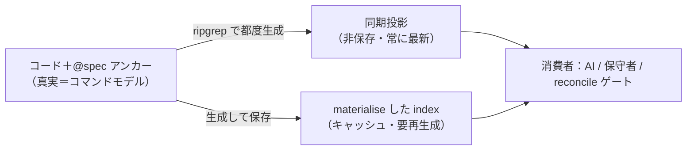

# シミュレーション: コード↔spec リンク＝CQRS の「投影（読み取りモデル）」

**位置づけ:** ddd-advisor の判断結論（コード＝真実／構造化データ＝投影）を、実在の has-udd 文脈で時系列に追って体感するための具体例。領域は CodingSchema / reconcile（**ES-3＝reconcile engine 帰属は未決**）。本書根拠＝第8章 CQRS（コマンド実行モデル＝真実を語る唯一の情報源／読み取りモデル＝投影・キャッシュ・複数可）。

> 用語の対応（これだけ覚えれば読める）
> - **コマンド実行モデル＝真実** ＝ コード＋ `@spec` アンカー（リンクが在る場所・SSOT）
> - **読み取りモデル＝投影** ＝ ripgrep で作る構造化 index（引きたい形・読み取り専用・再生成可）

---

## 登場人物（在るファイル）

| 役 | パス | 何者か |
|---|---|---|
| spec（WHAT・SSOT of 意図） | `.has-udd/documents/specs/uc-render-document.json` | 「検証済み Document を成果物に描画する」という仕様 |
| 規約 | `.has-udd/documents/coding/python-hexagonal.json` | code-template（書き方の枠） |
| 実装（これから生まれる） | `src/has_udd/application/usecases/render_engine.py` | uc-render-document の HOW |

---

## Scene 1 — 新規実装：リンクが「生まれる」

AI に指示が来る: **「uc-render-document を実装して」**。

このセッションは spec を参照しているので、AI の頭の中では「render_engine は uc-render-document の実装」と分かっている。これを**コードに固定**する（アンカー先置き）。アンカーは**言語ごとの正式な DocComment（Python＝docstring / Java＝Javadoc / TS＝JSDoc …）の中にカスタムタグとして**置く（`@param` や `@deprecated` と同じ枠）:

```python
# src/has_udd/application/usecases/render_engine.py
class RenderEngine:
    """検証済み Document を成果物に描画する。

    @spec uc-render-document
    @stack python-hexagonal
    """
    def execute(self, document_id: str) -> Result:
        ...  # HOW（実装の詳細。spec には書かない）
```

> 言語が変われば DocComment 構文も変わる（同じ `@spec` タグを各言語の作法で載せる）:
> ```java
> /**
>  * 検証済み Document を成果物に描画する。
>  * @spec uc-render-document
>  * @stack python-hexagonal
>  */
> public class RenderEngine { ... }
> ```
> ripgrep は構文に関係なく `@spec <id>` を拾えるので、投影生成は言語非依存。

**DocComment が持つもの／持たないもの（重要）:**
- 持つ = `@spec`/`@stack` アンカー ＋ **HOW の短い要約**（人が読む用）。
- **持たない = 詳細設計（契約）そのもの**。契約（MainFlow / Postconditions / Errors / AcceptanceCriteria）は **spec が持ち、HTML＝詳細設計書に render される**。DocComment にも書くと spec と二重管理＝drift するので、**契約は `@spec` で指すだけ**。

この瞬間の状態:
- **真実（SSOT）＝この `@spec uc-render-document` アンカー**。リンクはコードと同時に生まれ、ここに在る。
- **投影はまだ無い**。だが必要になったら「コードから作れる」。

> ⚠️ ここがあなたの問いの核心：「アンカーが無い瞬間の SSOT は？」→ **その瞬間の SSOT は spec**（意図）。リンクはまだ存在しない（コードが無いから）。アンカーはリンクを**永続化した結果**。

---

## Scene 2 — 投影を作る：構造化データはここで生まれる

`has-udd reconcile scan`（※Phase5・未実装の想定コマンド）を叩くと、ripgrep が固定タグ `@spec`/`@stack` を走査し、**引きたい形の index** を決定的に生成する:

```jsonc
// 投影（読み取りモデル）= spec を起点にした index。1ファイル＝全 spec 分。
{
  "uc-render-document": {
    "implementedBy": ["src/has_udd/application/usecases/render_engine.py::RenderEngine"],
    "stack": ["python-hexagonal"]
  },
  "uc-query-document": {
    "implementedBy": ["src/has_udd/application/usecases/query_engine.py::QueryEngine"],
    "stack": ["python-hexagonal"]
  }
  // ...
}
```

**ここが「ソースと同じ数の document.json が生まれる」懸念への回答:**
- 投影は **「引きたいクエリの形」** で作る（`spec → 実装一覧`）。**コード1ファイルにつき1 JSON ではない**。
- 上の index は **全 spec をまとめた1枚**。ファイル数とは無関係。
- コマンドモデル（ソース）の粒度を 1:1 で写すのは CQRS 的にアンチパターン（不要な複雑さ）。

---

## Scene 3 — 保守フェーズ：変更はどこを起点に、どう既存へ届くか

具体の変更依頼: **「render は PDF も出せるようにし、出力時に checksum を emit する」**（＝WHAT が増える）。

UDD なので **spec 先行**。順番はこう:

1. **spec を直す（WHAT の SSOT）**: `uc-render-document.json` に Postcondition「checksum emit」と format「pdf」を追記。← **詳細設計の変更はここ**（DocComment ではない）。
2. **再 render**: `has-udd render uc-render-document` → 詳細設計書(HTML) が更新され、**`.feature` に新シナリオが RED で立つ**（あるべき姿が先に赤で立つ）。
3. **既存実装を“探す” ← 投影の出番**: `spec→impls` 投影を引く → `uc-render-document → render_engine.py::RenderEngine`。**勘で grep するのではなく、投影が居場所を教える**。これが「既存を探す」の正体。
4. **コード（HOW）を直す**: 新 `.feature` が緑になるよう `render_engine.py` を修正。**DocComment の `@spec` アンカーは変えない**（実装先は同じ uc-render-document）。HOW 要約コメントだけ必要なら更新。
5. **ゲート**: `.feature`（振る舞い＝緑）＋ `reconcile`（リンク整合＝orphan/未カバー無し）。両方緑で整合。

**DocComment を直すのはどんな時か**（「既存を探して DocComment を修正」イメージへの回答）:

| 変わったもの | 直す場所 |
|---|---|
| 契約（詳細設計）＝Postcondition 等 | **spec.json** を直して再 render（DocComment ではない） |
| 実装先の spec を付け替えた / id 変更 | DocComment の **`@spec` タグ** |
| 使う stack を変えた | DocComment の **`@stack` タグ** |
| HOW の要約 | DocComment の要約（任意） |

⚠️ `reconcile` が言えるのは「リンクが在るか」まで。「新 Postcondition を実装が満たすか」（＝振る舞い）は `.feature` で確かめる。投影は在処、テストは意味。役割が違う。

ハンドメンテの台帳（second SSOT）は更新漏れで drift するが、**コードから毎回作る投影は定義上 drift しない**。保守で効くのはこの性質。

---

## レンダリング元はどこか ＝ spec.json（コードではない）

「render するなら render 元が在るはず」← その通り。has-udd の render 元は**常に document.json**。ここでは:

- **詳細設計書(HTML) / `.feature` の render 元 ＝ spec（`uc-render-document.json`）**。詳細設計（MainFlow・Postconditions・Errors・AcceptanceCriteria）は spec が持ち、render される。
- **コードは render 元を持たない**（機械生成するのは `.feature` だけ＝「実装テンプレ非提供」）。**コードは書くもの**で、document.json から render しない。
- だから **DocComment に契約を流し込む render 源は無い**。DocComment は authored（anchor＋要約）。契約の render 源は spec で、コードはそれに `@spec` で**ポイントするだけ**。

2方向を混同しないこと:

```mermaid
flowchart LR
    SPEC["spec.json<br/>（契約＝WHAT・render元）"] -->|順方向: render| DOC["詳細設計書 HTML / .feature"]
    CODE["コード @spec<br/>（HOW・authored）"] -->|逆方向: 投影 ripgrep| IDX["index（spec→impls）"]
    CODE -.->|@spec で参照| SPEC
```

- **順方向（render）**: spec → 詳細設計書 / `.feature`
- **逆方向（投影）**: code → index（spec→impls）
- どちらも「コードを json から render」はしない。

---

## Scene 4 — AI 重複回避：これが投影の最大の実利

新しいセッション。AI に指示: **「ドキュメントを PDF で出す機能を足して」**。

**投影が無い世界（今）:**
- AI は既存を知らずに `pdf_export.py` を新規に書き始める → `RenderEngine` が既に render の責務を持つのに**重複実装**。

**投影が在る世界:**
1. AI は着手前に投影を引く → 「render 系は何が在る？」
2. `uc-render-document → RenderEngine` がヒット。
3. AI は `uc-render-document.json` の spec＋`.feature` を読む。
4. 判断: 「PDF は render の1 format。新規でなく `RenderEngine` の format 拡張だ」→ **重複を回避**。

> 本書の言葉（第2章）: 用語集は「**新メンバーが事業活動を学ぶ時の最初の参照先**」。**AI は毎セッション“新メンバー”**なので、投影＝その最初の参照先。
> 限界（同・第2章）: 用語集は「**振る舞いは表現できない**」。だから投影は**候補発見**まで。意味の重複判定は spec/`.feature` が担う。**投影は必要だが十分ではない**。

---

## Scene 5 — 保存方式：非保存（同期投影）か、保存（キャッシュ）か



| 方式 | 中身 | 長所 | 短所 | 本書の指針 |
|---|---|---|---|---|
| **同期投影（現状）** | 引くたび ripgrep | 常に最新・drift ゼロ・保存物なし | クエリのたび走査 | **「まず同期投影から始めよ」=推奨の初期姿勢** |
| **materialise（A′）** | index を保存 | AI のコンテキストに載せやすい・速い | 再生成しないと腐る | 「投影結果のキャッシュ」として許容（後から足す最適化） |

has-udd の既存決定 **`_index` 動的化（保存せず読むとき計算）** と同じ。**descriptor は「コードに対する `_index`」**。materialise するなら同じ規律（非権威・engine 再生成・hand-edit 禁止）。

---

## 品質は `.feature` 単独では決まらない（HOW品質は多層で守る）

`.feature` が保証するのは「契約＝振る舞いが満たされたか」だけ＝**品質の床**。テストを通る“悪いモデル”はすり抜ける（DDD第6章のアンチパターン: 基本データ型への執着・貧血・集約境界の誤り・命名のズレ、＋既存と重複した実装）。だからHOW品質は**多層**で守る。

| 層 | 守るもの | 実装状況（正直に） |
|---|---|---|
| **spec ＋ `.feature`** | 契約・振る舞いの**床** | ✅ 実装済み（SpecSchema・behave・緑） |
| **code-template 規約** | HOW構造（ヘキサゴナル/集約/VO/命名） | △ 枠＋サンプルは在る・**強制は弱い**（規約準拠は手動/サンプル追従） |
| **同じ言葉（ユビキタス言語）** | spec とコードの**語彙一致** | ❌ 機械検査なし（NDepend 相当が無い） |
| **投影（spec→impls index）** | 既存発見＝**重複防止** | ❌ 未実装（reconcile/ES-3・Phase5） |

**結論:** 契約の床（spec＋`.feature`）は固まっている。だが HOW品質を守る上の層（**規約の強制・同じ言葉の検査・投影**）は**思想と骨格はあるが実装が伴っていない**。＝考慮“できる”構造ではあるが、考慮“しきれている”構造ではまだない。これらは **Phase3（code-template enrich）/ Phase5（Hooks・reconcile）** の宿題。

---

## 検討漏れ（未 surface の論点・忖度なし監査）

「多層で守る」骨格は描けたが、以下はまだ設計していない。特に OQ-3 は土台を揺るがす。

| # | 穴 | なぜ効くか | 状態 |
|---|---|---|---|
| **OQ-1** | アンカーの多重度（ヘキサゴン横断） | 1 spec を複数コード（in/app/out）が実現・1コードが複数 spec に跨る。spec→impls の 1:1 前提が崩れる。粒度（class/fn/layer）と many-to-many が未設計 | 🔴 新規 |
| **OQ-2** | 「spec を持たないコード」の規約 | 純インフラ/グルー/util に `@spec` は不要なはず。線引き無しだと reconcile が偽 orphan を量産 | 🔴 新規 |
| **OQ-3** | **ドメインモデル整合のゲートが無い** | `.feature` は振る舞いのみ。コードが domain-model spec の 集約/VO/不変条件を実現しているかを検査する層が空白。「設計はコードに宿る」の宿り方が無検証 | 🔴 新規・最重要 |
| **OQ-4** | 不変条件のユニットテスト | domain-model の `UnitTestScenarios` が render/実行されているか未確認。ピラミッドの底が無いと invariant を守れない | 🟠 要確認 |
| **OQ-5** | 重複防止の「強制」 | 投影が在っても「着手前に引け」を強制する hook が無ければ機能しない。index の存在≠重複防止 | 🟠 中 |
| **OQ-6** | 2つのグラフの混同 | OKF（document↔document の frontmatter relations）と code↔spec 投影は別物。スコープ/関係が未整理（code を graph ノードにするか） | 🟠 中 |
| **OQ-7** | spec supersede 時のアンカー寿命 | 旧 spec を指すコードの移行規約が無い | 🟠 中 |

**既に open として追跡済み（漏れではない）:** reconcile 発火点→`design-hooks`(H-1〜7) ／ 既存コード取り込み・大規模移行→`design-maintenance-loop`(ML-5/6) ／ reconcile の engine 帰属→ES-3。

---

## まとめ（1枚）

- **真実はコード（アンカー）＋ spec。構造化データ（descriptor）は投影＝読み取りモデル。** 二重 SSOT にしない。
- 「構造化で持つべき」というあなたの直感は **投影として正しい**。「非保存」は **本書推奨の同期投影**。保存は後から足すキャッシュで、SSOT は動かさない。
- 投影は **クエリの形**で作る（spec→impls）。**one-json-per-file はやらない**（CQRS アンチパターン）。
- **保守＝drift しない追跡**、**AI＝重複回避の最初の参照先**、が投影の二大実利。ただし**意味の判定は spec/`.feature`**（投影は在処まで）。

## 次アクション候補

- ES-3（reconcile engine 帰属）を決める時、この「投影」位置づけを設計前提にする。
- `reconcile scan` の**投影スキーマ（spec→impls の形）**を1枚決める（CodingSchema 側）。
- まず同期投影で実装 → AI コンテキスト供給で困ったら materialise を足す。
</content>
