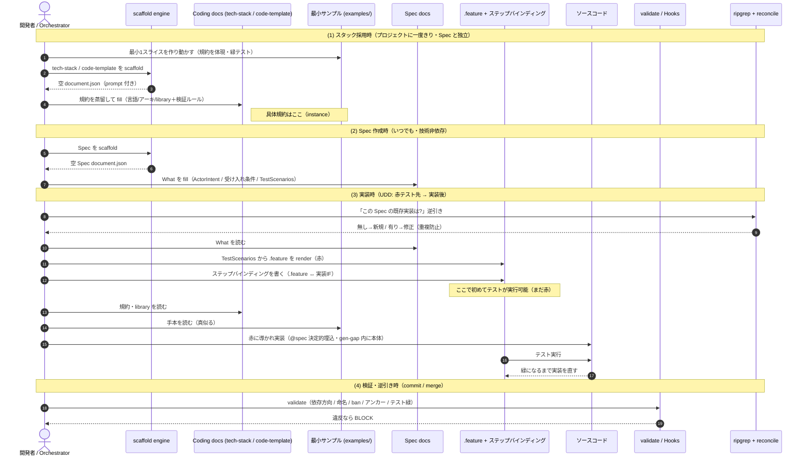
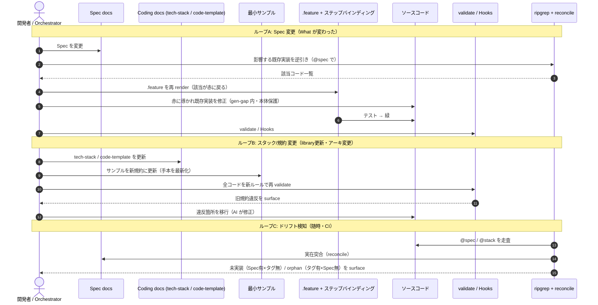

# CodingSchema インスタンス作成と Spec の関係（時系列シーケンス）

CodingSchema の instance（tech-stack / code-template / 最小サンプル）が **いつ作られ**、
**Spec とどう関係し**、**変更時にどう保守されるか**をイベントごとに整理する。

鍵: tech-stack / code-template / サンプルは「スタック採用時に一度だけ」Spec と独立に作られ、
**実装時に初めて両者が合流**する。そして **UDD なので赤テストが先・実装が後**。

> 旧版からの修正: (a) .feature(赤) を実装より**前**に移動（UDD 準拠）/ (b) ステップバインディングを明示 / (c) 変更時シーケンスを追加。

---

## 図1: 作成フロー（初回・happy path）

---

## 図2: 変更フロー（陳腐化が実際に起きる場所）

初回作成より、こちらの変更ループの方が陳腐化リスクの本体。

---

## 時系列の関係（要点）

| イベント | 作られる Coding instance | Spec との関係 |
|---|---|---|
| (1) スタック採用時（一度きり） | tech-stack・code-template・最小サンプル | Spec とは無関係（技術側だけ先に整う） |
| (2) Spec 作成時（いつでも） | （作られない） | Spec は技術非依存で独立に増える |
| (3) 実装時 | （作られない・既存を読む） | ここで Spec × tech-stack × code-template が合流 |
| (4) 検証 / 逆引き | （作られない） | コードの @spec を Spec と reconcile |
| ループA Spec 変更 | （作られない） | Spec→影響コード逆引き→赤→修正→緑 |
| ループB スタック変更 | tech-stack/code-template/サンプルを**更新** | 全コードを新ルールで再 validate→移行 |

---

## 一番大事な3点

1. tech-stack / code-template / サンプル = スタックごとに「一度」作り、**スタック変更時に更新**（ループB）
2. Spec = 技術を知らずに「いつでも」作る（What 専用）。変更時はループA（赤テスト駆動）
3. 実装時に Spec(What) × tech-stack/code-template(How) が合流 → コード（@spec 決定的埋込）

---

## 未解決の設計論点（正直な明記・要ブレスト）

| # | リスク | 状態 |
|---|---|---|
| ④ | **固定サンプルの鮮度**: トークン効率で固定サンプルを手本にしたが、規約進化で腐る。ループBの「サンプル更新」をどうトリガ/保証するか未設計 | 未解決 |
| ⑤ | **②(規約 instance) と ③(サンプル) の drift**: 別々に作るので片方だけ更新されるとズレる。「サンプルが自分の検証ルールを通る」CI 機構が要る | 未解決 |
| — | ループB の「全コード再 validate→移行」の規模・自動化粒度（大規模時の現実性） | Phase 3 で検討 |
