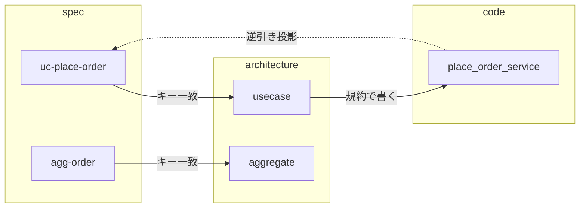

<!-- CS-3「概念キー化」の具体イメージ。4 codingKind（tech-stack/architecture/coding-standard/test-standard）× spec を、EC「注文を確定する」1本で通す。 -->

# CS-3 具体例 — 「注文を確定する」で概念キー化を見る

**狙い:** 「aggregate/usecase をどう実装する？」に **spec 自身から辿って答えられる**状態を、実物イメージで示す。
**登場する spec:** `agg-order`（aggregate）／ `uc-place-order`（usecase・aggregateRef=agg-order）。subdomain=`sd-sales`（中核）。

---

## 全体像（同じ概念語が3か所に出る＝これが「キー化」）



> spec の `specKind`（usecase / aggregate）＝ architecture の concept キー ＝ code の `@spec` 先、が一貫する。左から右が「実装の辿り方」、点線が `@spec` の逆引き（投影）。

**ポイント:** `usecase` / `aggregate` という**同じ語**が spec の `specKind`、architecture の `concept`、code の `@spec` 先に一貫して現れる。だから片方から片方を**辿れる**。

---

## ① spec（SpecSchema・技術非依存）

```
uc-place-order（usecase）
  意図: カートを注文として確定したい
  aggregateRef: agg-order
  受け入れ: When 在庫が足りる Then 注文は PLACED

agg-order（aggregate）
  subdomainRef: sd-sales   ← Category=中核（厚み SSOT はここ）
  不変条件: 合計=明細の和（守り方=schema）／支払い前は出荷不可（守り方=guard）
  コマンド: place（前提=新規 → 後=PLACED・発行 OrderPlaced）
```

> ここに「Python」「クラス」「ファイル」は一切無い。

---

## ② architecture codingKind（＝概念キーの本体）

`.has-udd/documents/coding/architecture/python-hexagonal.json`（イメージ・値だけ抜粋）:

```
architecture: python-hexagonal
conceptMap:                       ← ★spec の概念でキー化（specKind と 1:1）
  usecase:
    placement: src/app/usecases/{name}_service.py
    pattern:   application service・エントリ run()・@spec を打つ
  aggregate:
    placement: （集約クラスは作らない）
    pattern:   不変条件=schema／status 遷移=guard（src/domain/services）
  value-object:
    placement: src/domain/model/
    pattern:   frozen dataclass（不変）
dependencyRules:
  - domain ← application ← adapters（内向きのみ）
  - 外部ライブラリは adapter 経由（domain から直接呼ばない）
thicknessBySubdomain:             ← subdomain spec の Category を参照（値は複製しない）
  中核:  厚い設計（明示モデル）
  一般:  ライブラリを adapter で薄く包む
  補完:  最小のトランザクションスクリプト
```

**これが CS-3 の肝:** 「`uc-place-order` はどう実装？」→ specKind=`usecase` → conceptMap.`usecase` を引く → **配置とパターンが即決まる**。

---

## ③ coding-standard codingKind（＝横断の書き方・リンク機構）

`.has-udd/documents/coding/coding-standard/python-hexagonal.json`（イメージ）:

```
coding-standard: python-hexagonal
anchorConvention:                 ← ★code→spec を結ぶ「書き方」の SSOT
  specTag:  "@spec {id}"          （docstring 先頭に置く）
  stackTag: "@stack {name}"
genGap:                            ← 再生成保護マーカー
  start: "# has-udd:impl-start"
  end:   "# has-udd:impl-end"
naming:
  usecase: "ファイル {verb}_service.py／クラス {Verb}Service"
```

> architecture が「**どこに・どの型で**」、coding-standard が「**どう書くか・どう spec に結ぶか**」。骨格と細部の分離。

---

## ④ 実装（authored・②③の規約に従うだけ）

```python
# src/app/usecases/place_order_service.py
class PlaceOrderService:
    """注文を確定する。

    @spec uc-place-order        ← coding-standard の anchorConvention
    @stack python-hexagonal
    """
    def run(self, cart: Cart) -> OrderId:
        # has-udd:impl-start
        self._stock.allocate(cart.lines)
        order = place_order(cart.lines, cart.addr)  # 集約は薄い関数＋schema
        self._orders.save(order)
        return order.id
        # has-udd:impl-end
```

- `class Order` にコマンドをメソッドで…は**作らない**（aggregate の pattern＝schema+guard）。
- 置き場・命名・アンカーは全部②③の写し。**AI/人はこの規約を読んで書く**（＝サンプルが手本）。

---

## ⑤ 逆向き＝投影（code→spec・あなたが最初に欲しがった価値）

```
$ rg "@spec" src/
place_order_service.py:  @spec uc-place-order
→ 投影: 「uc-place-order は place_order_service.py が実装済み」
```

- **新規実装の前にこの投影を見る**＝「その usecase もう実装ある？」が分かる＝**重複を作らない・既存を辿れる**。
- spec 側から見れば「この usecase の実装はここ」が常に分かる（保守フェーズで効く）。
- reconcile はこの投影を機械照合するだけ（drift 検知）＝**ボーナス**。第一目的は探索・重複防止。

---

## ⑥ test-standard の関連（おまけ）

```
uc-place-order の TestScenarios（spec）
  → render で place_order.feature を生成
  → test-standard の binding 規約で features/steps/ に束ねて実行
```

`.feature` は spec から生成、**test-standard は「どう実行に束ねるか」だけ**を持つ。

---

## まとめ（CS-3 の答え）

| codingKind | この例での役割 |
|---|---|
| tech-stack | Python/hexagonal・`@stack` の宛先（capability） |
| **architecture** | **concept（usecase/aggregate/VO）→ 配置・パターン**＝spec 概念で1:1に辿れる本体 |
| coding-standard | `@spec` の書き方・命名・gen-gap＝**横断のリンク機構** |
| test-standard | TestScenarios→.feature→binding |

**「aggregate/usecase はどう実装？」に spec から architecture を辿って答えられ、`@spec` の逆引きで実装から spec に戻れる。** これが CS-3 の「概念キー化＋双方向リンク」。
