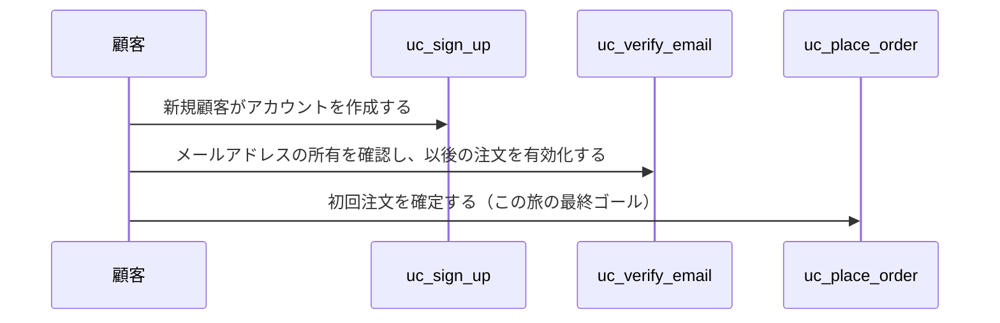
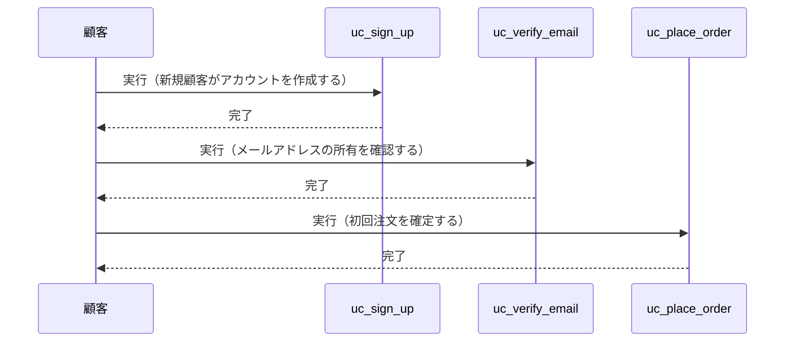
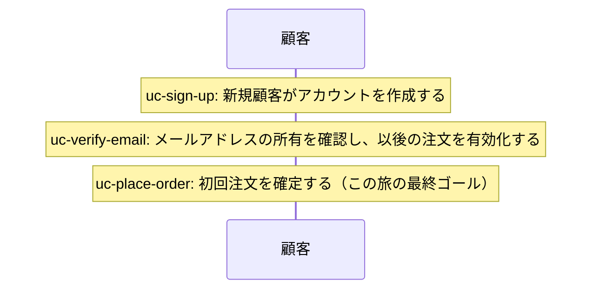
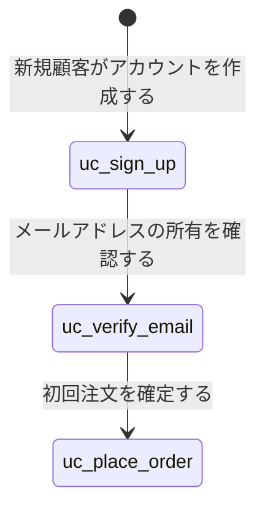
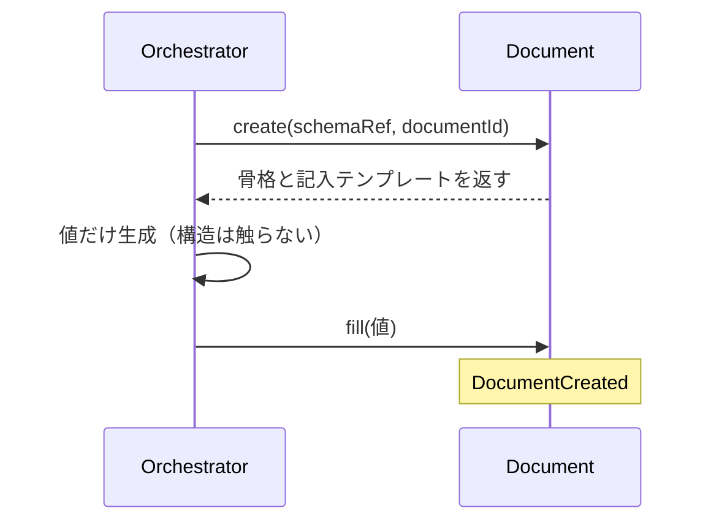

# PresentationSpecSchema「業務ユースケースの並び」レンダリングパターン比較

`flow-first-purchase`（新規顧客の会員登録→メール確認→初回注文確定）を素材に、Mermaidでの表現候補を並べる。RenderMetaSchemaの`sequence`/`statediagram`パートで実際に描画可能な形のみを比較する。

---

## 案A: sequence（command のみ・顧客→各usecase）

- データ形: `{from: "顧客", to: "uc-sign-up", message: "...", kind: "command"}` を usecase の数だけ列挙
- 各usecaseが独立した参加者（レーン）として描画される。応答（return）は無い。

---

## 案A': sequence（command + return・呼出/完了の往復あり）

- データ形: usecase 1つにつき command 1件 + return 1件（計2件）を列挙
- 「呼び出して完了を待つ」という往復が明示される分、①より視覚的に「やりとり」らしく見える

---

## 案B: sequence（event のみ・顧客1本のタイムラインにNote）

- データ形: `{from: "顧客", message: "...", kind: "event"}` のみ
- 参加者は顧客1本だけ。usecase同士の呼び出し関係が無いため、往復のニュアンスは無い。

---

## 参考: statediagram（今回不採用・状態が「留まる」ものに使う例）

- Document/Schemaのstatus管理（CREATED→VALIDATED→...）と同じ表現。usecaseは「留まる状態」ではなく「起きる出来事」なので意味的に不一致。

---

## 参考: 既存dogfoodで動いている sequence（command/self/return/event混在・uc-scaffold-document）

- 1つのusecase内部の、複数参加者（Orchestrator/Document）間の実際のやりとりを表現する本来の用途。
