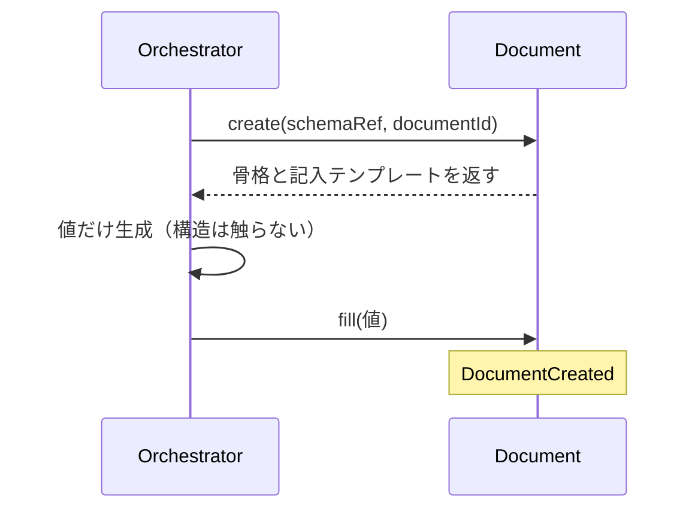
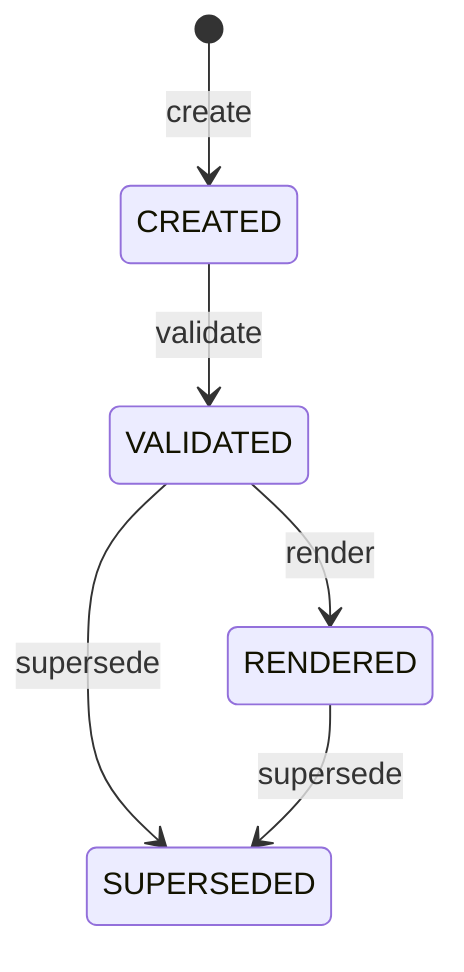
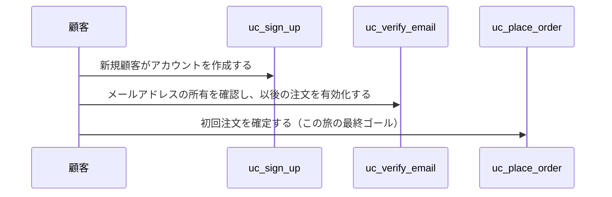

# RenderMetaSchema 現状のレンダリングパターン（Mermaid部分）

`RenderMetaSchema/v1`の閉じた語彙10種のうち、Mermaidを描画するのは`sequence`と`statediagram`の2つ。実際に`part_renderer.py`がどこまで実装しているかを、実データ（dogfoodコーパス）と実装コードの両方から確認する。

---

## 1. `sequence`（`uc-scaffold-document`のMainFlowより・現状のまま）

**schema側の宣言（DomainSpecSchema/v2.json MainFlowBlock）:** `{from, to, message, kind}`・`kind` ∈ `command`/`self`/`return`/`event`

**実際の出力（dogfoodコーパスに実在）:**



**`part_renderer._sequence`の実装（全て）:**
```python
def _sequence(steps):
    lines = ["sequenceDiagram"]
    for s in steps:
        frm = _seq_token(s.get("from", ""))
        to = _seq_token(s.get("to", "") or s.get("from", ""))
        msg = str(s.get("message", "")).replace("\n", " ")
        kind = s.get("kind", "command")
        if kind == "event":
            lines.append(f"    Note over {frm}: {msg}")
        elif kind == "return":
            lines.append(f"    {frm}-->>{to}: {msg}")
        else:  # command / self
            lines.append(f"    {frm}->>{to}: {msg}")
    ...
```

**カバーしている範囲:** `->>`（command）・`-->>`（return）・自己ループ（self）・`Note over`（event）の4種のみ。

**カバーしていない範囲（今回の調査で判明したMermaidの全機能との差分）:**
- `actor`宣言（人間のアクターを`participant`と区別する専用記法）
- `activate`/`deactivate`（活性化表示）
- `box`（参加者のグループ化）※そもそもMermaid v11.16.0側にバグあり
- `alt`/`opt`/`par`/`critical`/`break`（制御構造）
- `loop`（繰り返し）
- 双方向矢印・非同期矢印・×印矢印
- `autonumber`

---

## 2. `statediagram`（`agg-document`のLifecycleより・現状のまま）

**schema側の宣言（DomainSpecSchema/v2.json LifecycleBlock）:** `{from, to, command}`

**実際の出力（dogfoodコーパスに実在）:**



**`part_renderer._statediagram`の実装（全て）:**
```python
def _statediagram(transitions):
    lines = ["stateDiagram-v2"]
    for t in transitions:
        frm = _seq_token(t.get("from", ""))
        to = _seq_token(t.get("to", ""))
        cmd = str(t.get("command", "")).replace("\n", " ")
        lines.append(f"    {frm} --> {to}: {cmd}")
    ...
```

**カバーしている範囲:** 単純な`from --> to: command`の遷移列のみ（`[*]`開始/終了は`from`/`to`に文字列として渡せば動く）。

**カバーしていない範囲:**
- `<<choice>>`（条件分岐疑似状態）
- `<<fork>>`/`<<join>>`（並行分岐・合流）
- 複合（入れ子）状態
- `--`ディバイダによる並行領域
- `direction`指定

---

## 3. 今回のFlow用に新設した`UsecaseSequence`（今回作った暫定版）

`sequence`パートをそのまま流用（`actor`区別なし・現状のPresentationSpecSchemaの設計のまま）:



「顧客」も各usecaseも同じ`participant`扱いで区別が無く、今回の「アクター表現が微妙」という指摘の原因はここにある。

---

## 論点

1. `sequence`パートに`kind`の新しい値として、参加者を`actor`宣言するための仕組み（例: 各ステップの`from`/`to`とは別に、事前に「どの識別子がactorか」を宣言するリスト）を追加するか。
2. `statediagram`パートに`choice`/`fork`/`join`を追加するか（現状のLifecycle表現では使われていないが、将来の複雑な状態遷移で必要になりうる）。
3. 上記を追加する場合、`RenderMetaSchema`（閉じた語彙）と`part_renderer.py`（実装）の両方を拡張する必要がある——閉じた語彙を広げること自体が設計判断（無制限に増やすと「AIが自由にレイアウトロジックを書ける」状態に近づき、当初の「宣言的・閉じた語彙」の意図から外れるリスクがある）。
