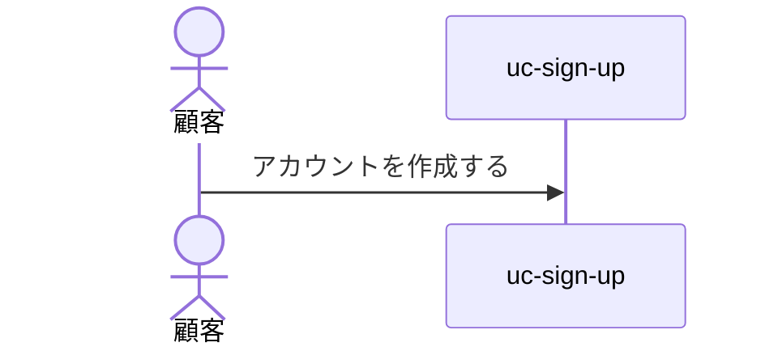
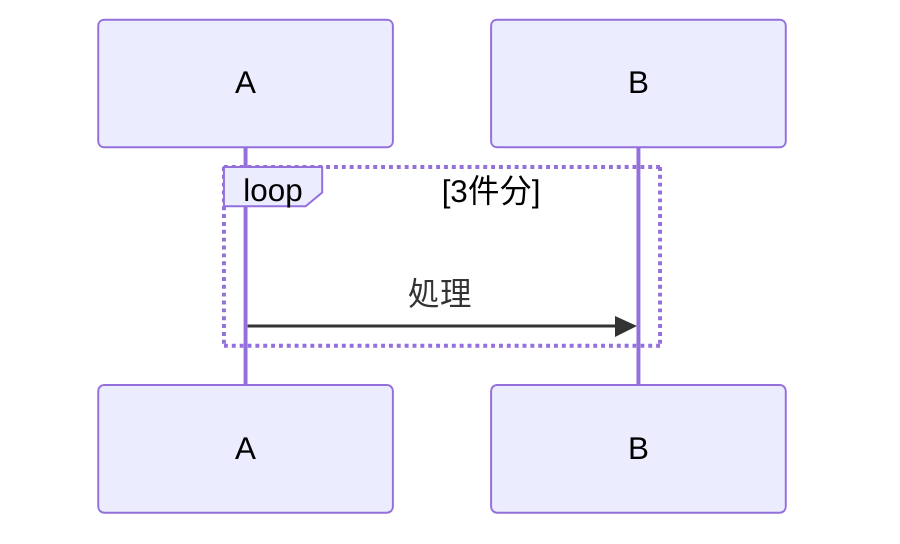
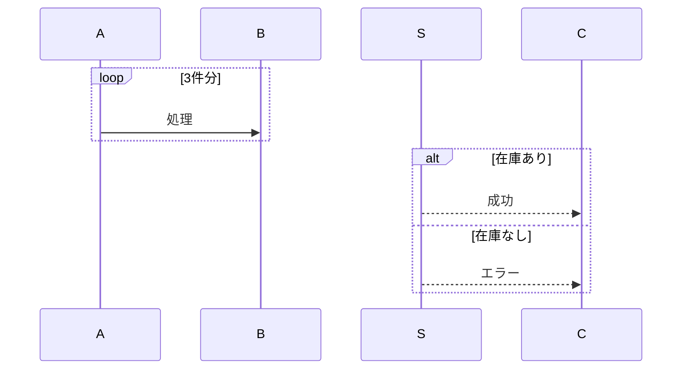
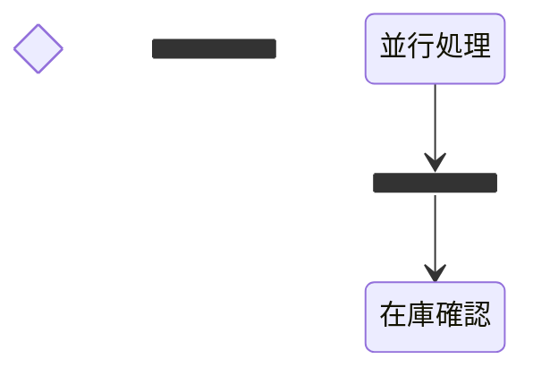

# RenderMetaSchema拡張案：sequence / statediagram の表現力を増やす

現状の`sequence`/`statediagram`パートは、Mermaidの機能のごく一部（`->>`/`-->>`/`Note over`と単純遷移のみ）しか使えない。閉じた語彙という原則を保ちながら、どこまで表現力を増やすかの選択肢を提示する。

---

## A. アクター表現（人型 `actor` の追加）

### パターンA-1: 参加者を事前宣言する（推奨）

`sequence`パートに、ステップの配列とは別に「参加者一覧」を宣言する。各参加者に`kind: actor | participant`を持たせる。

**schema側の宣言（RenderPart拡張案）:**
```json
{
  "as": "sequence",
  "from": "items",
  "participants": [
    { "id": "顧客", "kind": "actor", "label": "顧客" },
    { "id": "uc_sign_up", "kind": "participant", "label": "uc-sign-up" }
  ]
}
```

**data側（block値・変更なし、items配列は今まで通り）:**
```json
{
  "items": [
    { "from": "顧客", "to": "uc_sign_up", "message": "アカウントを作成する", "kind": "command" }
  ]
}
```

**出力:**


**利点:** 既存の`items`構造を変えずに済む（後方互換）。`participants`は任意（無ければ従来通り全員`participant`扱い）。
**欠点:** `participants`と`items`の`from`/`to`が同じidを指す前提の整合を、engineが機械チェックする必要がある（typoで参加者未宣言のid → 黙って通常participantとして扱われる、等）。

### パターンA-2: ステップ側にkind情報を持たせる（非推奨・冗長）

各ステップに`fromKind`/`toKind`を持たせる方式。同じ参加者が複数ステップに出るたびに繰り返し宣言することになり冗長。パターンA-1の方が良い。

---

## B. sequence の制御構造（loop / alt / activate）

### パターンB-1: フラットな開始/終了マーカー方式

`kind`にMermaidの制御構造をそのまま追加し、開始・終了を別ステップとして表現する（既存の配列構造を維持したまま拡張）。

**kind拡張案:** `command` / `self` / `return` / `event`（既存） + `loop-start` / `loop-end` / `alt-start` / `alt-else` / `alt-end` / `opt-start` / `opt-end`

```json
{
  "items": [
    { "kind": "loop-start", "message": "3件分" },
    { "from": "A", "to": "B", "message": "処理", "kind": "command" },
    { "kind": "loop-end" }
  ]
}
```

**出力:**


**利点:** 既存の配列構造（フラットなitems）を壊さない。実装もシンプル（開始/終了マーカーを見たらインデント切替するだけ）。
**欠点:** 開始と終了のペアが崩れている（start無しでend、ネスト不整合等）とMermaid自体がエラーになる——engineが対の整合性をチェックする必要がある。

### パターンB-2: 入れ子構造方式（Mermaidの文法に忠実）

`kind: "loop"` / `"alt"`のステップが、自分の中に子ステップ配列を持つ（`section`パートの`each`と同じ再帰パターン）。

```json
{
  "items": [
    {
      "kind": "loop",
      "message": "3件分",
      "steps": [
        { "from": "A", "to": "B", "message": "処理", "kind": "command" }
      ]
    },
    {
      "kind": "alt",
      "branches": [
        { "label": "在庫あり", "steps": [ { "from": "S", "to": "C", "message": "成功", "kind": "return" } ] },
        { "label": "在庫なし", "steps": [ { "from": "S", "to": "C", "message": "エラー", "kind": "return" } ] }
      ]
    }
  ]
}
```

**出力:**


**利点:** 対応関係が構造（JSON の入れ子）で保証される。開始/終了ペアが崩れることは構造上あり得ない（B-1の弱点を解消）。
**欠点:** schema・part_rendererの実装がB-1より複雑（再帰処理が要る）。

### パターンB-3: activate/deactivateの追加（B-1/B-2どちらとも併用可）

各ステップに`activate: true`/`deactivate: true`のフラグを追加。

```json
{ "from": "A", "to": "B", "message": "呼出", "kind": "command", "activate": true }
```

**出力:** `A->>+B: 呼出`

---

## C. statediagram の疑似状態（choice / fork / join）

`statediagram`パートに、遷移一覧`transitions`とは別に「疑似状態一覧」を宣言する（A-1のparticipantsと同じ考え方）。

```json
{
  "as": "statediagram",
  "from": "items"
}
```
```json
{
  "pseudoStates": [
    { "id": "判定", "kind": "choice" },
    { "id": "fork_state", "kind": "fork" },
    { "id": "join_state", "kind": "join" }
  ],
  "transitions": [
    { "from": "並行処理", "to": "fork_state", "command": "" },
    { "from": "fork_state", "to": "在庫確認", "command": "" }
  ]
}
```

**出力:**


---

## 推奨する組み合わせ

- **アクター表現**: A-1（参加者の事前宣言）を採用。
- **制御構造**: B-2（入れ子構造）を採用。B-1は開始/終了ペアの崩れをengineが検出できず、Mermaid自体のエラーとしてしか露見しない（デバッグしづらい）ため。
- **statediagram**: C案を採用（A-1と同じ設計言語で一貫）。

いずれも既存の`items`配列という基本構造を壊さない拡張（`participants`/`pseudoStates`という新しい任意フィールドの追加）なので、既存のMainFlow/Lifecycleの実データへの後方互換は保たれる。

この組み合わせで進めてよいですか？
