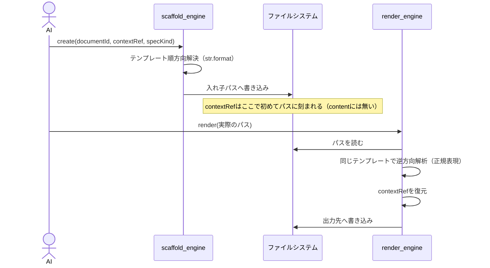

# specフォルダの入れ子構造が、なぜ機械的にレンダリングできるのか

`.waffle/documents/specs/`配下をbounded-context単位の入れ子構造にした際、「contextRefという、document自体には保存しない値を使ってパスを組み立てる」という一見矛盾した仕組みがどう成立するかを説明する。

---

## 1. 何が課題だったか

SP-2（過去の合意）は「所属文脈（context）は保存しない・フォルダから動的に分かる」としていた。しかし入れ子フォルダにするには、そもそも**どのフォルダに書くか**を決める段階で`contextRef`（どのbounded-contextに属するか）を知る必要がある。「フォルダを見ればcontextRefが分かる」を実現するには、まず「そのフォルダにファイルを置く」ところから始めなければならず、**鶏と卵の関係**になる。

## 2. 解決の仕組み：往復で構造は保存せず、パスだけに刻む

答えは「`contextRef`を**documentのcontentには保存しないが、ファイルパスという別の場所には刻まれている**」という状態を作ること。具体的には2つの操作を非対称に設計する。

### create（新規作成）＝ 順方向：変数からパスを組み立てる

```
テンプレート:  .waffle/documents/specs/{contextRef}/aggregate/{documentId}.json
入力:          contextRef="bc-waffle-engines", documentId="agg-document"
                          ↓ str.format()
結果パス:      .waffle/documents/specs/bc-waffle-engines/aggregate/agg-document.json
```

`contextRef`は、この瞬間だけ**CLIの引数として明示的に渡す**（`waffle scaffold --contextRef bc-waffle-engines ...`）。document自体のJSONには一切書き込まない。書き込む代わりに、**ファイルパスという構造そのものに刻む**——これが「保存しない」の実際の意味。

### render（再描画）＝ 逆方向：パスから変数を読み戻す

再度そのdocumentを描画する時、`contextRef`はもうCLI引数として渡されない（documentのJSONを見ても書いていない）。ではどうやって知るか——**今度は「渡されたファイルパス」自体から逆算する**。

```
テンプレート:  .waffle/documents/specs/{contextRef}/aggregate/{documentId}.json
実際のパス:    .waffle/documents/specs/bc-waffle-engines/aggregate/agg-document.json
                          ↓ 正規表現で逆マッチ
復元結果:      {"contextRef": "bc-waffle-engines", "documentId": "agg-document"}
```

テンプレートの`{変数名}`をキャプチャ用の正規表現に変換し、実際のパス文字列と突き合わせることで、埋め込まれていた値を機械的に取り出す。これは`create`の逆演算そのもの。

## 3. 全体の流れ（1つのdocumentのライフサイクルを通して）



## 4. specKindごとにテンプレートが違う理由

`aggregate`はbc直下、`usecase`は`subdomain/{subdomainRef}/`の下——specKindごとに構造が異なる。そのため`x-source-target`は単一の文字列ではなく、**specKindをキーにした辞書**になっている。

```json
"x-source-target": {
  "aggregate": ".waffle/documents/specs/{contextRef}/aggregate/{documentId}.json",
  "subdomain": ".waffle/documents/specs/{contextRef}/subdomain/{documentId}.json",
  "usecase":   ".waffle/documents/specs/{contextRef}/subdomain/{subdomainRef}/{documentId}.json"
}
```

engineは、documentが実際に持つ discriminator（`specKind`）の値を見て、対応するテンプレートを選ぶ。`usecase`の場合、`subdomainRef`はdocument自体に既に保存されているフィールドなので（`agg-document`のような集約参照と同様）、逆算に頼らずdocumentから直接読める。**逆算がどうしても必要なのは、document自体に保存しない`contextRef`だけ**。

## 5. 検証したこと（推測ではなく実測）

実際にengineを通して確認済み:
- `waffle scaffold create --contextRef bc-waffle-engines --subdomainRef sd-harness-core ...` → 正しい入れ子パスに保存される
- そのパスを`waffle render`に渡す → `contextRef`が正しく復元され、正常に描画される
- 実際の12個のdocumentを新しい入れ子構造へ移動し、全てvalidate・render・pytest 24/24・behave 70/70で確認済み
