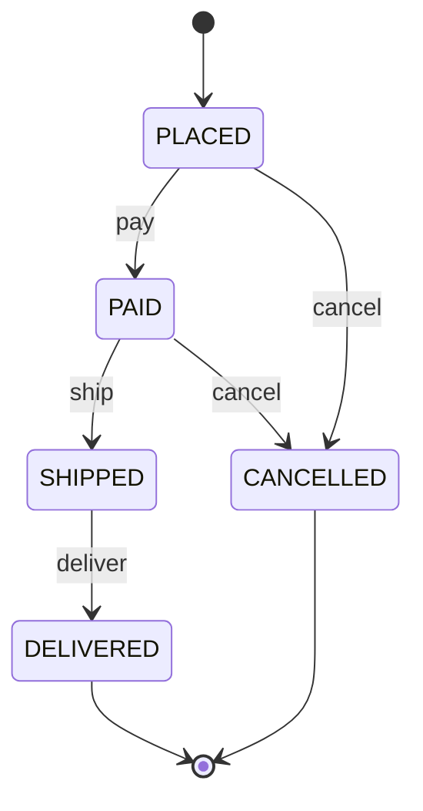

# 注文（Order）

顧客が確定した購入の単位を表す集約。

- 明細・金額・配送先・状態を、一貫性境界の内側に持つ
- 状態の変更は、必ず注文自身のコマンドを経由する

**集約ルート** — 注文（Order）　|　**外部参照** — 顧客（`customerId`）・商品（`productId`）は ID で参照

---

## エンティティ

識別子を持ち状態が変化する。ルートを通じてのみ変更される。

| エンティティ | 役割 | 識別子 | 属性（型 = 値オブジェクト） |
|---|---|---|---|
| 注文（Order）★ルート | 注文全体を束ねる | orderId | status: OrderStatus ／ shippingAddress: ShippingAddress ／ customerId ／ total: Money ／ lines: OrderLine[] |
| 注文明細（OrderLine） | 商品ごとの行 | lineId | productId ／ quantity: Quantity ／ unitPrice: Money |

OrderLine の小計 = unitPrice × quantity。

---

## 値オブジェクト

| 値オブジェクト | 表すもの | 振る舞い・制約 |
|---|---|---|
| Money | 通貨つきの金額 | 不変。加算・減算は同一通貨のみ。負値不可 |
| Quantity | 注文数量 | 正の整数のみ。0 以下は生成不可 |
| ShippingAddress | 配送先住所 | 郵便番号・都道府県・市区町村・番地。生成時に形式検証 |
| OrderStatus | 注文の状態 | enum（下記）。値は VO、遷移は不変条件で守る |

---

## 不変条件

| ルール | 根拠 |
|---|---|
| 注文合計 = 全明細の小計の合計 | 金額の整合性 |
| 明細は 1 つ以上ある | 空の注文を許さない |
| 支払い済みでなければ出荷できない | 未収金での出荷を防ぐ |
| キャンセルは出荷前のみ可能 | 出荷後は返品プロセスで扱う |

---

## ライフサイクル



| from | to | command | 条件 |
|---|---|---|---|
| PLACED | PAID | pay | 支払いが承認された |
| PAID | SHIPPED | ship | — |
| SHIPPED | DELIVERED | deliver | — |
| PLACED / PAID | CANCELLED | cancel | 出荷前である |

---

## コマンド

外部はこのコマンドを経由してのみ、注文の状態を変更できる。

| command | 何をするか | 引数 | 前提状態 | 発行イベント | 後状態 |
|---|---|---|---|---|---|
| place | カート内容から注文を確定する | lines, address | （新規） | OrderPlaced | PLACED |
| pay | 支払い結果を反映する | paymentId | PLACED | OrderPaid | PAID |
| ship | 出荷を記録する | trackingNo | PAID | OrderShipped | SHIPPED |
| cancel | 注文を取り消す | reason | PLACED / PAID | OrderCancelled | CANCELLED |

---

## ドメインイベント

| イベント | payload | 契機 |
|---|---|---|
| OrderPlaced | orderId, lines, total | 注文確定時 |
| OrderPaid | orderId, paymentId | 支払い反映時 |
| OrderShipped | orderId, trackingNo | 出荷時 |
| OrderCancelled | orderId, reason | 取消時 |

---

## ユニットテストシナリオ

### 支払い前の注文は出荷できない

| 分類 | 観点 |
|---|---|
| 異常系 | 状態遷移：未収金での出荷を防ぐ不変条件が効く |

```gherkin
Scenario: 支払い前の注文は出荷できない
  Given status が PLACED の注文
  When ship する
  Then 拒否される（支払い済みでない）
```

### 注文合計は明細の小計の合計に一致する

| 分類 | 観点 |
|---|---|
| 正常系 | 計算整合：合計 = 明細の小計の和 が保たれる |

```gherkin
Scenario: 注文合計は明細の小計の合計に一致する
  Given 単価 500 × 数量 2 と 単価 300 × 数量 1 の明細を持つ注文
  Then 合計は 1300 である
```

### 出荷後の注文はキャンセルできない

| 分類 | 観点 |
|---|---|
| 異常系 | 状態遷移：キャンセルは出荷前のみという不変条件が効く |

```gherkin
Scenario: 出荷後の注文はキャンセルできない
  Given status が SHIPPED の注文
  When cancel する
  Then 拒否される（出荷前のみ可）
```
