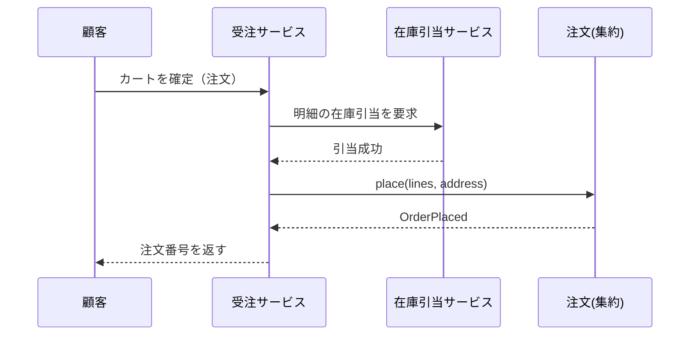

# 注文を確定する（uc-place-order）

顧客がカートの内容を確定し、在庫を引き当てて注文を成立させる操作。

| 項目 | 内容 |
|---|---|
| 所属 subdomain | 受注管理 |
| 対象集約 | 注文（Order） |
| 主アクター | 顧客 |
| 意図 | カートの商品をまとめて注文として確定したい |
| 関与する外部 | 在庫コンテキスト（引当）／決済コンテキスト（後続の支払い） |

## 事前条件

- カートに 1 つ以上の明細がある
- 顧客の配送先が登録されている

## 基本フロー



## 事後条件

- 注文が PLACED 状態で作成される
- 明細ぶんの在庫が引き当てられる
- OrderPlaced イベントが発行される

## 受け入れ基準

- When カートに明細があり在庫が足りるとき、注文は PLACED で作成される。
- When 在庫が不足するとき、注文は作成されず在庫不足を通知する。
- While カートが空のとき、注文は確定できない。

## エラー

| コード | 条件 |
|---|---|
| EMPTY_CART | カートに明細が無い |
| OUT_OF_STOCK | いずれかの明細で在庫が不足 |
| ADDRESS_MISSING | 配送先が未登録 |

## テストシナリオ

**背景（共通の前提）** — 商品の在庫が登録済みで、顧客の配送先が設定されている

### 在庫のあるカートを注文として確定する

| 分類 | 観点 |
|---|---|
| 正常系 | 基本動作：在庫が足りれば注文が成立し在庫が引き当てられる |

```gherkin
Scenario: 在庫のあるカートを注文として確定する
  Given 明細を2つ持つカートと十分な在庫
  When 注文を確定する
  Then 注文が PLACED で作成される
  And 在庫が引き当てられる
```

### 在庫不足では注文できない

| 分類 | 観点 |
|---|---|
| 異常系 | 在庫：在庫不足時は注文を作らずエラーを返す |

```gherkin
Scenario: 在庫不足では注文できない
  Given 在庫が不足する明細を含むカート
  When 注文を確定する
  Then エラーコード "OUT_OF_STOCK" で失敗する
  And 注文は作成されない
```

### 空のカートは注文できない

| 分類 | 観点 |
|---|---|
| 異常系 | 事前条件：明細ゼロの注文を弾く |

```gherkin
Scenario: 空のカートは注文できない
  Given 明細が無いカート
  When 注文を確定する
  Then エラーコード "EMPTY_CART" で失敗する
```
