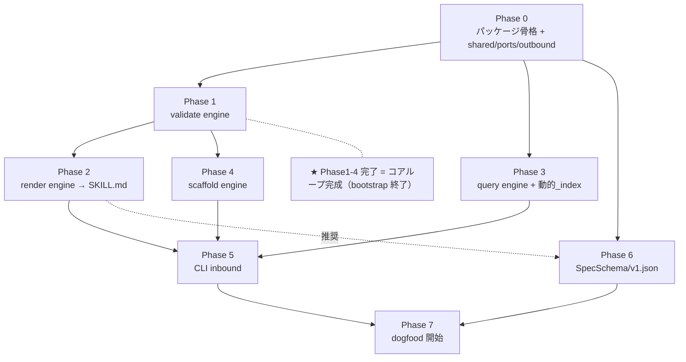

# has-udd 実装計画（bootstrap → dogfood）

## 原則

1. **コア4engine（scaffold/validate/render/query）は手作りで bootstrap**（spec 駆動できない＝鶏卵の核）
2. コアループが動いた瞬間に **dogfood へ移行**（has-udd 自身の Spec を書いて残りを spec 駆動）
3. bootstrap 成果物は **最初から「後で has-udd 管理下に snap-in できる形」**で作る（→ 末尾「移行レディ」）
4. アーキは確定済み: ヘキサゴナル `src/has_udd/`（`domain/model`=schema, `domain/ports`, `domain/services`, `application`=engines, `adapters/inbound[cli,mcp]`, `adapters/outbound[fs,jinja,jsonschema]`, `shared[result,tags]`）

---

## 依存関係グラフ

---

## フェーズ詳細

| Phase | 作るもの | 依存 | unlock するもの | 効果測定 |
|---|---|---|---|---|
| **0** | パッケージ骨格・`shared`(Result/契約定数)・`domain/ports`(SchemaRepository/DocumentRepository/Renderer/Validator)・`adapters/outbound`(fs/jsonschema/schema_repository) | なし | 全部 | import が通る・schema をロードできる |
| **1** | **validate engine**（doc×schema を jsonschema 検証） | 0 | render の事前検証・scaffold の充填後検証 | 既存 `.has-udd/skills/*.json` が SkillSchema で PASS |
| **2** | **render engine**（Layer1 骨格Python＋Layer2 Jinja2 from x-render・blockType→$def・x-render-order ソート・step_h/substep_h・md/html） | 0,1 | **SKILL.md 生成**・deploy | `harness-query-engine.json → SKILL.md` が Claude Code skill として動く |
| **3** | **query engine**（doc 読取・x-prompt-query×blockType から **動的_index**・scan/get） | 0 | ナビゲーション・逆引きの土台 | doc から _index 取得・block を id で取得 |
| **4** | **scaffold engine**（create=空doc+prompt from x-prompt-write / fill=AI値をengineが書く / validate 再利用） | 0,1 | **コアループ完成** | 空SkillScaffold→fill→validate→render が一周 |
| **5** | **CLI inbound**（`has-udd validate\|render\|scaffold\|query`） | 1-4 | 実用ツール・測定容易化 | CLI で一連が叩ける |
| **6** | **SpecSchema/v1.json**（specKind=bounded-context/domain-model/usecase・Coding/Skill と同規約・x-render に "feature" 追加） | 0（推奨2,4後） | has-udd 自身の Spec を書ける | SpecSchema を scaffold/validate/render できる |
| **7** | **dogfood 開始**（has-udd 自身の UsecaseSpec を書く→残り機能を spec 駆動・bootstrap を retroactive に Spec 化） | 1-6 | 以降 spec 駆動開発 | bootstrap が has-udd 管理下に snap-in |

★ **Phase 1-4 完了がマイルストーン**（bootstrap 終了・コア思想の実証）。

---

## 移行レディ（bootstrap 成果物を後で has-udd 形式へ snap-in する仕込み）

手作り部分を後で spec 駆動管理へ無痛で取り込むため、**最初からこう作る**:

| 仕込み | 内容 | 効果 |
|---|---|---|
| **① @spec/@stack アンカーを先に埋める** | engine コードに placeholder の `@spec:uc-...` / `@stack:...` を最初から DocComment で付ける | 後で Spec を同 id で書けば逆引き/reconcile が即リンク |
| **② gen-gap マーカーを入れて書く** | 本体を `has-udd:impl-start/end` で囲む | 後の再生成・保護がそのまま効く |
| **③ 振る舞いを受け入れテストで固定** | engine の振る舞いを BDD 風テストで書く（PoC の verify.py の発展形） | これが後で UsecaseSpec の TestScenarios になる（テスト=移行の架け橋・SP-1） |
| **④ code-template 規約に沿って書く** | 確定した配置/命名/依存方向に最初から従う | 後で validation を on にした時、既存コードが既に通る |
| **⑤ engine = Skill document で表現済みを維持** | `.has-udd/skills/harness-*.json` は既に has-udd 文書 | SKILL レベルは移行済み。残るは Spec レベルだけ |
| **⑥ 「engine→将来 spec id」対応表を残す** | 例: render_engine → uc-render-document | retroactive な Spec 起こしが機械的になる |

→ **移行 = 「validation/reconcile を on にするだけ」**で既存コードが has-udd 管理下に入る状態を、bootstrap の時点で作っておく。

---

## 今やらないもの（基盤が整うまで後回し）

Hooks・HarnessAgent・reconcile engine・マルチツール互換・サンプル鮮度④⑤・MCP adapter。
いずれもコアループ（Phase 1-4）が動いてから具体化する。

---

## 最初の一歩

**Phase 0 → Phase 1 → Phase 2** を一筆で進め、`harness-query-engine.json → SKILL.md` を出すところまでを最初のスプリントにする（コア思想の一次実証）。
