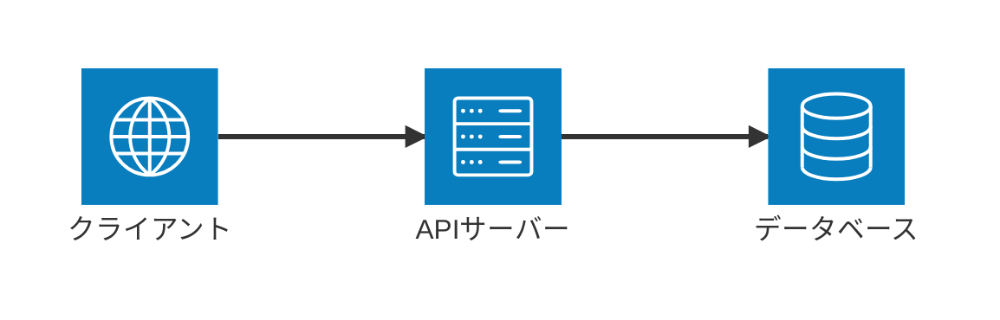

# architecture-beta によるAWS構成図バリエーション（プレビュー用・全て構文検証済み）

---

## v1: 標準アイコンのみ（Iconify不使用・最も互換性が高い）

---

## v2: Iconify AWSアイコンを使った2層構成

```mermaid
architecture-beta
    service alb(logos:aws-elb)["ALB"]
    service ecs(logos:aws-ecs)["ECS Fargate"]
    service rds(logos:aws-rds)["RDS"]

    alb:R --> L:ecs
    ecs:R --> L:rds
```

---

## v3: VPC内のPublic/Private Subnet構成（3グループ・ネスト）

```mermaid
architecture-beta
    group vpc(cloud)["VPC"]
    group publicSubnet(cloud)["Public Subnet"] in vpc
    group privateSubnet(cloud)["Private Subnet"] in vpc

    service alb(logos:aws-elb)["ALB"] in publicSubnet
    service ecs(logos:aws-ecs)["ECS Fargate"] in privateSubnet
    service rds(logos:aws-rds)["RDS Aurora"] in privateSubnet

    alb:R --> L:ecs
    ecs:R --> L:rds
```

（3グループ以上で`{group}`エッジ修飾子を使うと構文解析に失敗するバグがあるため、ここではグループ間エッジではなくservice間の直接エッジのみを使用）

---

## v4: junctionによる分岐（ロードバランサから複数ECSへ）

```mermaid
architecture-beta
    service client(internet)["クライアント"]
    junction j
    service ecs1(logos:aws-ecs)["ECS-1"]
    service ecs2(logos:aws-ecs)["ECS-2"]
    service rds(logos:aws-rds)["RDS"]

    client:R --> L:j
    j:T --> B:ecs1
    j:B --> T:ecs2
    ecs1:R --> L:rds
    ecs2:R --> L:rds
```

---

## v5: ALBから複数AZへのファンアウト（align不使用）

```mermaid
architecture-beta
    service alb(logos:aws-elb)["ALB"]
    service ecs1(logos:aws-ecs)["AZ-a"]
    service ecs2(logos:aws-ecs)["AZ-b"]
    service ecs3(logos:aws-ecs)["AZ-c"]

    alb:R --> L:ecs1
    alb:R --> L:ecs2
    alb:R --> L:ecs3
```

（元々`align row`ディレクティブでAZを横並びに揃える案だったが、環境によってプレビューが崩れることを確認したため撤回。`align`はarchitecture-betaの中でも比較的新しく枯れていない機能と見られ、依存しない書き方に変更した）

---

## 注意点

- v2〜v5は`logos:aws-*`というIconifyのアイコン名を使用。**閲覧環境がIconify連携に対応していないと、指定したアイコンではなくデフォルト表示になる可能性がある**（GitHub上のネイティブMermaidレンダリングでの対応状況は未検証）。
- v1（標準アイコンのみ）が最も互換性が高い。
